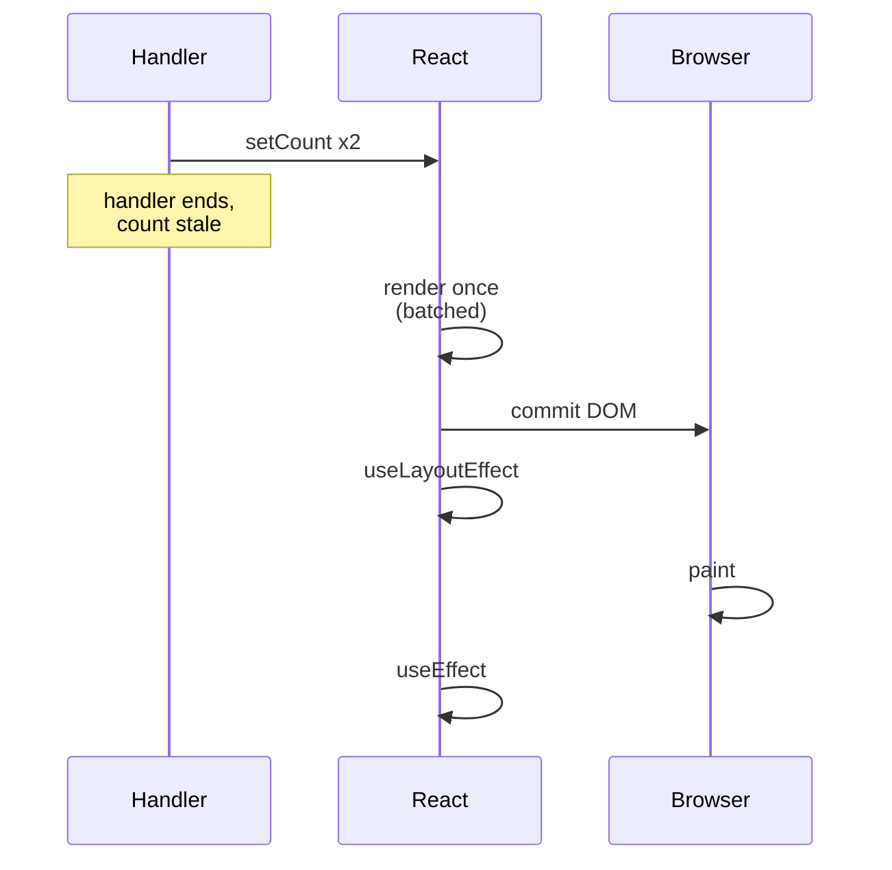

:::info[Prerequisites]
**Components & Props** — state is what makes those pure functions produce different output over time.
:::

## State is a snapshot, not a variable

`useState` doesn't give you a mutable box. It gives you the value **for this render**,
and a request to render again with a different one.

```tsx
function Counter() {
  const [count, setCount] = useState(0);

  function handleClick() {
    setCount(count + 1);
    console.log(count);      // still 0 — this render's snapshot
  }
  …
}
```

`count` here is a `const` captured by the closure of one particular render. Nothing
can change it, including `setCount`. The next render is a fresh call to `Counter`
with a fresh `count`, a fresh `handleClick`, and a fresh closure.

This is the source of the classic bug:

```tsx
setCount(count + 1);
setCount(count + 1);   // both read 0 → both set 1, not 2
```

The fix is the updater form, which receives the pending value rather than the
captured one:

```tsx
setCount(c => c + 1);
setCount(c => c + 1);   // 2
```

Use the updater whenever the next value depends on the previous one. It's also what
makes a setter safe to call from an effect or a callback that may run later, when
the captured snapshot is definitely stale.

## Render, commit, paint

A state update doesn't touch the DOM directly. It schedules a pass with a fixed
order, and knowing that order resolves most "why is this value wrong / why does it
flicker" questions.



The two setters in one handler produce **one** render — React batches updates. Since
React 18 this applies everywhere, including inside promises, `setTimeout` and native
event handlers, not just React event handlers.

The gap between `useLayoutEffect` and `useEffect` is the paint. A layout effect runs
synchronously after the DOM is written and before the browser draws, so it can
measure an element and adjust position without the user seeing the intermediate
state. It also blocks the paint, so it's the wrong default. Reach for it only when
you'd otherwise see a flash.

## Where state should live

Three questions, in order:

1. **Can it be derived?** If a value can be computed from existing state or props, compute it during render. Storing it creates two sources of truth that will drift.
2. **Does rendering depend on it?** If not, it isn't state — it's a ref.
3. **Who needs it?** Put it in the closest common ancestor of everything that reads it, and no higher.

The first is the most commonly violated:

```tsx
// Redundant state — filtered can go out of sync with items or query
const [items, setItems] = useState([]);
const [query, setQuery] = useState('');
const [filtered, setFiltered] = useState([]);
useEffect(() => setFiltered(items.filter(i => i.name.includes(query))), [items, query]);

// Derived — impossible to desynchronise
const filtered = items.filter(i => i.name.includes(query));
```

The second version is also *faster* in the common case: the first one renders twice
per change, once with stale `filtered` and once after the effect.

For the "doesn't affect rendering" case, `useRef` gives you a mutable box that
survives renders and never triggers one — the right home for a timer id, a
scroll position you only read on submit, or a DOM node.

| Need | Use |
| --- | --- |
| Rendering depends on it | `useState` |
| Computable from state/props | Nothing — derive it during render |
| Survives renders, never renders | `useRef` |
| Several fields change together, by rules | `useReducer` |

## `useReducer` and when it's worth it

`useState` is fine until the number of ways a piece of state can change grows past
the number of fields. A stepper wizard with `step`, `answers`, `errors` and
`isSubmitting` has four fields but a dozen transitions, and every event handler
that sets three of them is a chance to forget one.

`useReducer` moves those transitions into one place and out of the component:

```tsx
function reducer(state: FormState, action: FormAction): FormState {
  switch (action.type) {
    case 'answer':  return { ...state, answers: { ...state.answers, ...action.value }, errors: {} };
    case 'next':    return { ...state, step: state.step + 1 };
    case 'submit':  return { ...state, isSubmitting: true };
  }
}
```

The reducer is a pure function, so it's testable without rendering anything — which
is a real advantage, not a theoretical one. The tradeoff is indirection: for two
independent fields it's ceremony.

## Immutability isn't a style preference

React decides whether state changed with `Object.is`. Mutating an object and passing
the same reference back means no change was detected and no render is scheduled.

```tsx
items.push(newItem);      // same array reference
setItems(items);          // no re-render

setItems([...items, newItem]);   // new reference — renders
```

The same applies to nested updates. `{ ...user, address: { ...user.address, city } }`
is the manual version; libraries like Immer let you write mutations against a draft
and produce the new object for you.

## What to take away

- State is this render's snapshot. Use the updater form whenever the next value depends on the current one.
- Updates are batched into a single render, everywhere — including async callbacks.
- `useEffect` runs after paint; `useLayoutEffect` runs before it and blocks it. Only reach for the second to prevent a visible flash.
- Derive what you can. State that could have been computed is state that will eventually disagree with its source.
- Change detection is reference identity — mutating and re-setting the same object renders nothing.

## References

- [react.dev — State as a snapshot](https://react.dev/learn/state-as-a-snapshot) and [Queueing a series of state updates](https://react.dev/learn/queueing-a-series-of-state-updates)
- [react.dev — Choosing the state structure](https://react.dev/learn/choosing-the-state-structure)
- [react.dev — `useReducer`](https://react.dev/reference/react/useReducer) and [`useRef`](https://react.dev/reference/react/useRef)
- [React 18 — Automatic batching](https://github.com/reactwg/react-18/discussions/21) — the working-group note explaining the change and its edge cases.
