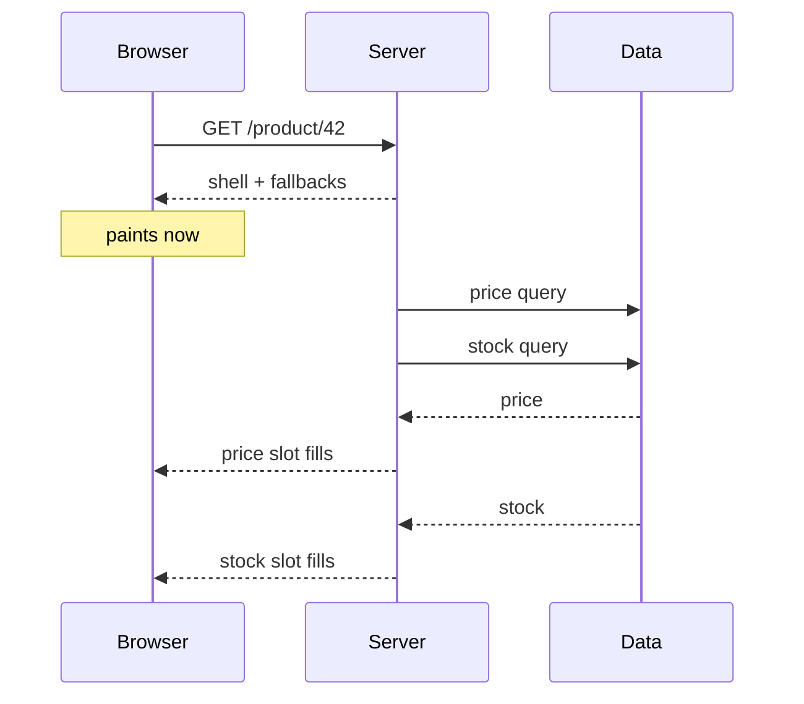

:::info[Prerequisites]
**Data Fetching & Caching** — streaming is what you do with the parts that can't be cached.
:::

## The problem streaming solves

Server rendering is all-or-nothing by default: the server awaits everything the page
needs, renders, and sends. One slow query — a recommendations service, a third-party
inventory API — holds the entire document, including the header that was ready
immediately.

Streaming breaks that coupling. The server sends the parts it has, keeps the
connection open, and sends each remaining part as it resolves. The browser paints
progressively.



The total work is unchanged. What changes is that time-to-first-byte no longer
depends on the slowest query on the page — and neither does the user's sense that
something is happening.

## Suspense is the unit

A `<Suspense>` boundary marks a subtree that may not be ready, and what to show
while it isn't.

```tsx
export default function Page() {
  return (
    <>
      <ProductHeader />                          {/* ready now */}
      <Suspense fallback={<PriceSkeleton />}>
        <Price />                                {/* awaits an API */}
      </Suspense>
      <Suspense fallback={<ReviewsSkeleton />}>
        <Reviews />                              {/* awaits a slow query */}
      </Suspense>
    </>
  );
}
```

Each boundary streams independently and in whatever order it resolves. `loading.tsx`
in a route folder is the file-convention version of the same thing: Next.js wraps
that segment's `page` in a boundary for you, which is the cheapest possible way to
get a route-level loading state.

Two things worth knowing about how boundaries behave:

- **Nesting is meaningful.** A boundary inside another shows its fallback within the outer one's resolved content, letting you stage a page: layout first, then the main content, then the expensive rail.
- **Suspense doesn't make anything dynamic.** A component doing only synchronous work completes during prerendering whether or not you wrapped it. The boundary tells React where it *may* wait, not that it will.

## Partial prerendering

Streaming and caching combine into the model Next.js 16 makes the default under
Cache Components: **one route, one response, static and dynamic parts together.**

At build time, Next.js renders the tree. Static markup and anything behind
`'use cache'` become the **static shell**, alongside the *fallbacks* of every
Suspense boundary. That shell is a real file, so it can be served from a CDN with no
server involved. The dynamic holes are then filled at request time over the same
streamed response.

The practical consequence is worth stating plainly: you no longer choose between a
fast static page and a personalised one. A page can be a CDN-served shell that
includes a per-user cart, because the cart is a hole in the shell rather than a
property of the route.

The old rule — "one `cookies()` call makes the whole route dynamic" — is what this
replaces.

## Boundary placement is a design decision

Where you draw boundaries determines what the page looks like while it loads, and
the failure modes are aesthetic rather than technical.

| Too few | Too many |
| --- | --- |
| One spinner for the whole page | A dozen skeletons popping in independently |
| The fast content waits for the slow content | Visible layout shift as each resolves |
| No sense of progress | Cognitive load; nothing feels stable |

Some guidance that holds up:

- **Draw the boundary around what a user would recognise as one thing** — a card, a table, a sidebar. Not around individual fields.
- **Make fallbacks the same shape as the content.** A skeleton with the real dimensions avoids the layout shift that a spinner guarantees. This is a Core Web Vitals concern (CLS), not just polish.
- **Push async work deep.** The deeper a fetch sits, the more of the tree can be prerendered above it. This is the same "maximise the static shell" instinct as pushing `'use client'` toward the leaves.
- **Not everything deserves a boundary.** If a query reliably takes 20ms, a skeleton for it is a flash of loading state, which reads as worse than a 20ms wait.

## Two things streaming doesn't fix

**Waterfalls.** Streaming makes a serialised chain of requests *look* better while
still taking as long. If `Reviews` awaits the product before it can fetch reviews,
wrapping it in Suspense doesn't parallelise anything. Fix the sequencing first, then
stream what's left.

**Bots and crawlers.** Next.js detects crawler user agents and renders the full page
dynamically for them rather than serving the shell, because a crawler needs a
complete document. This has a real trap: work that succeeded during prerendering now
runs at request time, so a shell that depends on build-time-only inputs can render
for a person and fail for a crawler.

Errors need boundaries too, and they're a separate mechanism: `error.tsx` at the
route level, or `catchError` for a component-level boundary. A Suspense fallback
covers slowness, not failure.

## What to take away

- Streaming decouples first byte from the slowest query; the work is the same, the perceived latency isn't.
- `<Suspense>` is the unit; `loading.tsx` is the route-level shorthand.
- Partial prerendering serves a CDN-cacheable shell with per-request holes filled over the same response — a route no longer has to be either static or dynamic.
- Boundary placement is UX: one per recognisable region, with fallbacks shaped like the content.
- Streaming hides waterfalls rather than fixing them, and crawlers get a full dynamic render instead of the shell.

## References

- [Next.js — Streaming](https://nextjs.org/docs/app/guides/streaming) and [`loading.js`](https://nextjs.org/docs/app/api-reference/file-conventions/loading)
- [Next.js — Prerendering and Partial Prerendering](https://nextjs.org/docs/app/getting-started/caching#prerendering)
- [react.dev — `<Suspense>`](https://react.dev/reference/react/Suspense)
- [web.dev — Cumulative Layout Shift](https://web.dev/articles/cls) — why fallbacks should match the content's dimensions.
