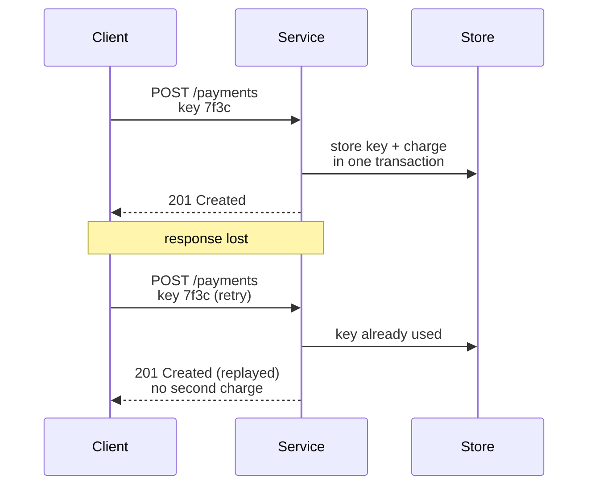
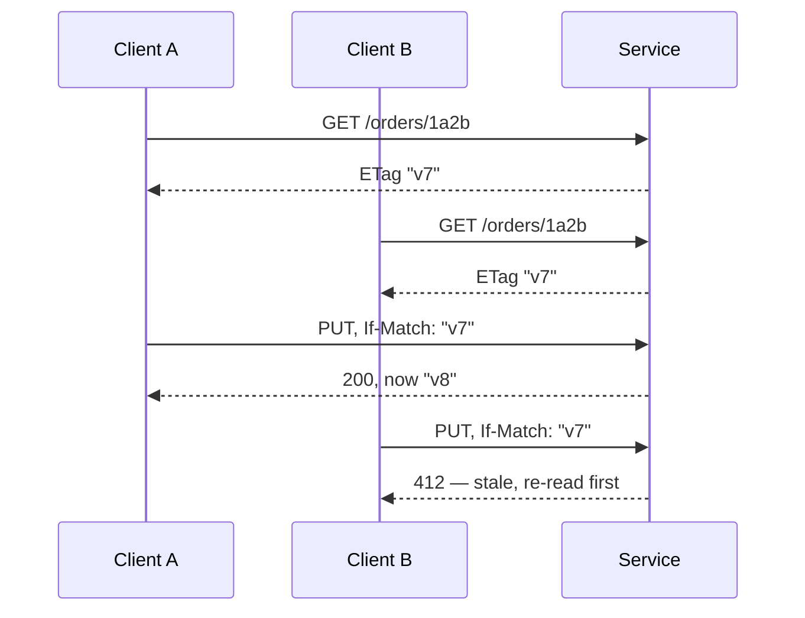

:::info[Prerequisites]
**Resources & Collections** — the methods below act *on* those resources.
:::

## Safe, idempotent, neither

Two properties defined in [RFC 9110 §9.2](https://www.rfc-editor.org/rfc/rfc9110.html#name-common-method-properties)
decide what infrastructure is allowed to do to your requests:

- **Safe** — read-only. Crawlers, prefetchers and browsers may issue it unprompted.
- **Idempotent** — issuing it N times has the same effect on the server as issuing it once. Proxies and clients may retry it.

| Method | Safe | Idempotent | Typical use |
| --- | --- | --- | --- |
| `GET` | ✅ | ✅ | Read a resource or collection |
| `HEAD` | ✅ | ✅ | Metadata/existence without the body |
| `PUT` | ❌ | ✅ | Replace a resource wholesale at a known URL |
| `DELETE` | ❌ | ✅ | Remove a resource |
| `POST` | ❌ | ❌ | Create into a collection; anything not otherwise mappable |
| `PATCH` | ❌ | ❌ | Partial update |

Two consequences people trip on constantly:

**A `GET` that changes state will be triggered by something you don't control.** A
link prefetcher, a chat client unfurling a URL, a security scanner. `GET /orders/1/delete`
is not a safe design with a scary name; it's a bug waiting for a crawler.

**`PATCH` is not idempotent in general.** `PUT` sets a value, so repeating it lands
in the same place. `PATCH` sends a change, and `{"op": "increment", "qty": 1}`
applied twice is not the same as once. A JSON Merge Patch
([RFC 7396](https://www.rfc-editor.org/rfc/rfc7396.html)) that only assigns fields
*is* idempotent in practice — but the method doesn't promise it, so infrastructure
won't retry it for you.

## Making `POST` retry-safe

`POST /payments` is the dangerous one: the network fails after the server committed
but before the response arrived, the client retries, and the customer is charged
twice. The fix is an **idempotency key** — a client-generated unique id the server
records with the result.

Details that matter: the key must be stored **in the same transaction** as the
effect, or a crash between the two reopens the hole; store a fingerprint of the
request body so a reused key with different content fails loudly rather than
replaying the wrong answer; and give keys a documented retention window. This is
the mechanism [Stripe](https://docs.stripe.com/api/idempotent_requests) exposes as
the `Idempotency-Key` header, now standardised as an
[IETF draft](https://datatracker.ietf.org/doc/draft-ietf-httpapi-idempotency-key-header/).

## Status codes worth being precise about

The class carries most of the meaning — `4xx` is "you", `5xx` is "us" — and clients
branch on it. Getting the class wrong is worse than getting the exact code wrong.

| Code | Meaning | Common misuse |
| --- | --- | --- |
| `200 OK` | Success, body included | Returning it with `{"error": ...}` inside |
| `201 Created` | Resource created; send a `Location` header | Omitting `Location` |
| `202 Accepted` | Work queued, not done | Used when the work *is* done |
| `204 No Content` | Success, deliberately no body | Sending a body anyway |
| `400 Bad Request` | Malformed/invalid input | Used as a catch-all for every 4xx |
| `401 Unauthorized` | Not authenticated (misnamed) | Used when the user *is* authenticated but lacks rights |
| `403 Forbidden` | Authenticated, not permitted | Used for "not found, and you may not know it exists" |
| `404 Not Found` | No such resource | Hiding a server bug behind it |
| `409 Conflict` | State conflict — duplicate, version mismatch | Squeezed into `400` |
| `422 Unprocessable Content` | Syntactically valid, semantically wrong | Interchanged with `400` at random |
| `429 Too Many Requests` | Rate limited; send `Retry-After` | Omitting `Retry-After` |
| `500` / `503` | Our fault / temporarily unavailable | Returned for input errors, which makes alerting useless |

`400` vs `422` is the argument that never resolves. A defensible line: `400` for
"I couldn't parse this", `422` for "I parsed it and the values are wrong". Pick a
rule, write it down, apply it everywhere. Inconsistency is the real cost.

The one that isn't taste: **never return `5xx` for client input errors.** Your error
budget, your alerts and your on-call rotation are all keyed on that class.

## Conditional requests: concurrency control you already have

Two clients read an order, both edit, both `PUT`. The second silently overwrites the
first. HTTP solves this with validators — `ETag` and `If-Match`.

The same validator serves caching in the read direction: a client sends
`If-None-Match: "v7"` and gets `304 Not Modified` with no body. One header, two
problems — optimistic concurrency and bandwidth.

`ETag` doesn't have to be a hash of the body. A row version column or an
`updated_at` timestamp works, and is cheaper.

## What to take away

- Method choice tells infrastructure what it may retry and prefetch. It isn't a naming preference.
- `POST` endpoints with side effects need an idempotency key, stored transactionally with the effect.
- Keep the status *class* honest above all else; `5xx` for bad input poisons every signal you have.
- `ETag` + `If-Match` is lost-update protection you get without inventing a version field in the body.

## References

- [RFC 9110 — HTTP Semantics](https://www.rfc-editor.org/rfc/rfc9110.html): [§9.2 method properties](https://www.rfc-editor.org/rfc/rfc9110.html#name-common-method-properties), [§13 conditional requests](https://www.rfc-editor.org/rfc/rfc9110.html#name-conditional-requests), [§15 status codes](https://www.rfc-editor.org/rfc/rfc9110.html#name-status-codes)
- [RFC 9111 — HTTP Caching](https://www.rfc-editor.org/rfc/rfc9111.html)
- [RFC 7396 — JSON Merge Patch](https://www.rfc-editor.org/rfc/rfc7396.html) and [RFC 6902 — JSON Patch](https://www.rfc-editor.org/rfc/rfc6902.html)
- [Stripe — Idempotent requests](https://docs.stripe.com/api/idempotent_requests)
- [MDN — HTTP response status codes](https://developer.mozilla.org/en-US/docs/Web/HTTP/Status)
