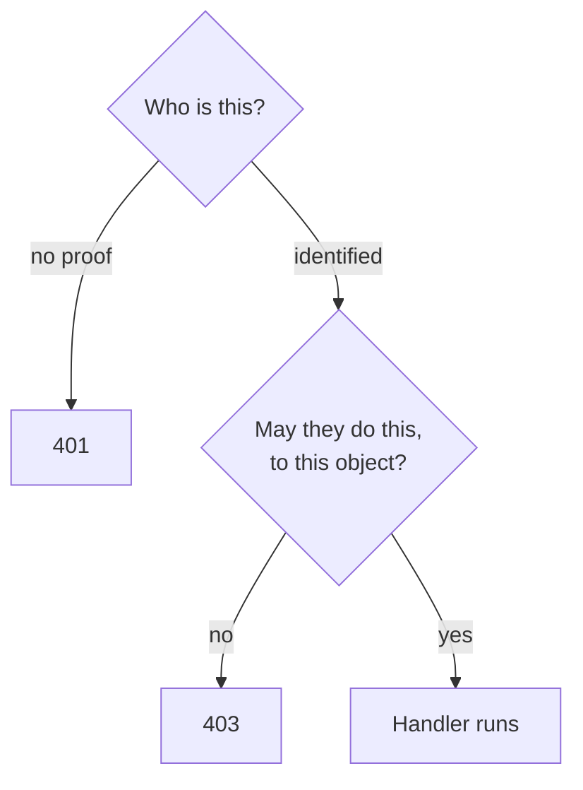

:::info[Prerequisites]
**REST API Design** for status codes, and either framework chapter for where this code sits in a service.
:::

## Why this chapter exists

Authentication and authorization are the two questions every request carries, and
they are routinely collapsed into one word — "auth" — which is where a surprising
number of vulnerabilities begin.

Getting the first one right is mostly a matter of adopting a standard and not
deviating from it. The second is where the genuinely hard, application-specific work
lives — and where the most common serious API vulnerability sits: **broken object-level
authorization**, an endpoint that verifies who you are, then hands you a record
belonging to someone else because the id was in the URL. It has led the
[OWASP API Security Top 10](https://owasp.org/API-Security/editions/2023/en/0x11-t10/)
since the list began.

## What this chapter assumes you won't build

Rolling your own identity provider, password hashing scheme, or token format is not
a reasonable default. The standards are old, attacked, and well specified; the
libraries implementing them have had years of scrutiny that your afternoon won't
reproduce.

This chapter therefore covers what you need to **integrate correctly** and **verify
rigorously** — the parts that stay your responsibility no matter which provider you
use.

## What's in here

| Page | What it covers |
| --- | --- |
| Sessions & Tokens | The two models for carrying identity, and what each costs |
| OAuth 2.0 & OIDC | The flows worth knowing, the ones that are deprecated, and what OIDC adds |
| JWTs in Practice | Validation you must not skip, claims, lifetimes and revocation |
| Authorization Models | RBAC, ABAC and ReBAC, and where enforcement actually belongs |

## Where this connects

**Row-Level Security & Access Control** in Track 3 is the same authorization question
pushed down into the database, which is the strongest available answer to the
object-level problem above — the two chapters describe two halves of one mechanism:
token auth at the edge, row scoping in Postgres.

## References

- [OWASP API Security Top 10 (2023)](https://owasp.org/API-Security/editions/2023/en/0x11-t10/)
- [RFC 9700 — Best Current Practice for OAuth 2.0 Security](https://www.rfc-editor.org/rfc/rfc9700.html)
