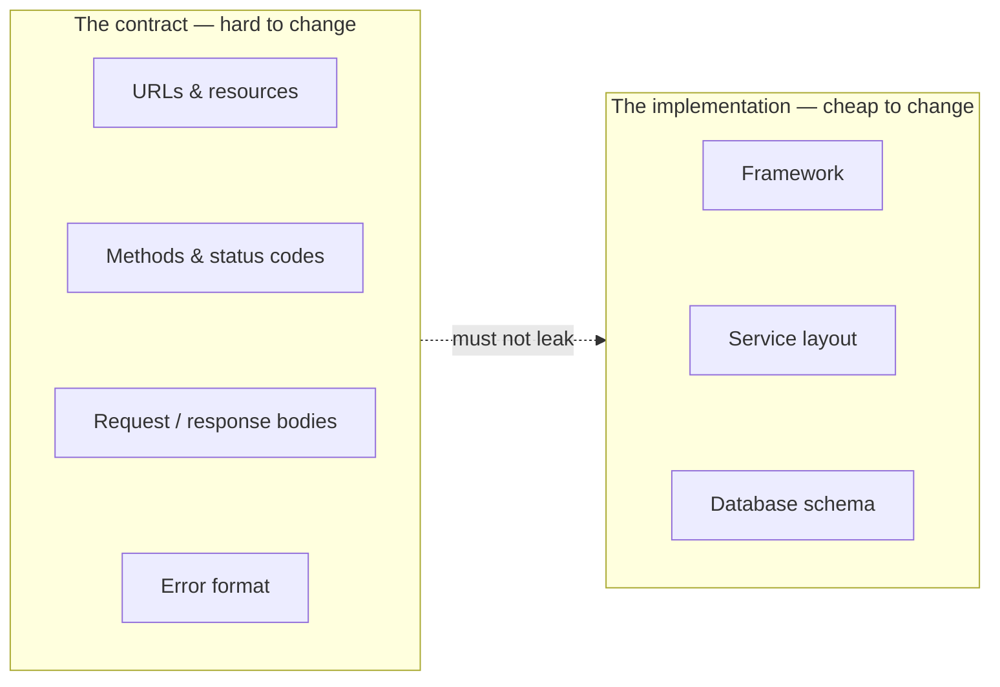

:::info[Prerequisites]
None. This is the first chapter of the track — start here if you're starting anywhere.
:::

## Why this chapter exists

An HTTP API is a **contract**, and the contract outlives almost everything around
it. The framework gets replaced, the database gets migrated, the service gets split
in two — and the URLs, status codes and JSON shapes stay, because someone else's
code depends on them.

That asymmetry is the whole reason to design deliberately. Internal code can be
refactored on a Tuesday afternoon. A published response body cannot, because you
don't control the clients and you often can't even enumerate them.

The single most common design failure is letting the right-hand box leak into the
left: an endpoint named after the table it queries, an error body that's a stack
trace, a response that changes shape because someone added a JOIN.

## What "REST" is being used to mean here

Strictly, REST is Roy Fielding's architectural style, and most APIs called RESTful
don't satisfy all of it — in particular they skip
[hypermedia controls](https://roy.gbiv.com/untangled/2008/rest-apis-must-be-hypertext-driven),
which Fielding considers non-negotiable.

This chapter uses the industry meaning: **resource-oriented HTTP with JSON**, using
the methods and status codes as the specs define them. That's a lower bar than REST
proper, and it's the bar worth actually hitting — most APIs fail on HTTP semantics
long before hypermedia becomes the limiting factor.

## What's in here

| Page | What it covers |
| --- | --- |
| Resources & Collections | Modelling nouns, URL structure, and designing collections that survive growth |
| HTTP Semantics | Methods, idempotency, status codes, and the concurrency control you get for free |
| Error Contracts | RFC 9457 problem details, and making failures as designed as successes |
| Versioning & Evolution | Which changes break clients, and the versioning strategies with their real costs |

## Where this connects

**Spring Boot & Kotlin** and **FastAPI & Python Services** are two implementations of
what's designed here — the same contract decisions, expressed in two very different
frameworks. **Authentication & Authorization** covers the part of the contract that
decides who gets a `200` and who gets a `403`.

If you read one page, read *HTTP Semantics*. Most of what people call "API design
taste" is just knowing what the methods and status codes already mean.

## References

- [RFC 9110 — HTTP Semantics](https://www.rfc-editor.org/rfc/rfc9110.html) — the current, consolidated HTTP spec; supersedes the RFC 723x series.
- [Fielding, "REST APIs must be hypertext-driven"](https://roy.gbiv.com/untangled/2008/rest-apis-must-be-hypertext-driven) — the author's own objection to how the term gets used.
