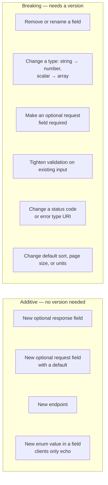

:::info[Prerequisites]
**Error Contracts** — error shapes are part of what you're promising not to break.
:::

## Compatible vs breaking

Versioning is the fallback. The first question is whether the change needs a version
at all, and the answer follows from one asymmetry: **clients ignore what they don't
recognise, and crash on what disappears.**

Three that get misfiled as safe:

**New enum values.** Safe only if clients pass the value through. If they `switch` on
it, a new value is a breaking change delivered without warning — which is why the
value set is worth documenting as open or closed from day one.

**Tightening validation.** Rejecting input you used to accept breaks every client
that was sending it, even if it was always invalid on paper.

**Changing defaults.** Moving the default page size from 100 to 20 changes what every
existing caller receives, without a single field changing shape.

Adding a *required* response field is technically safe for readers, but it locks you
in: once a client depends on it, it's no longer removable.

## The strategies, and what each costs

| Strategy | Example | Cost |
| --- | --- | --- |
| **URL path** | `/v2/orders` | Most visible and cache-friendly. Version leaks into every URL, so resource identity changes when only its representation did. |
| **Media type** | `Accept: application/vnd.example.v2+json` | Theoretically correct — you're versioning the representation. Awkward to call from a browser, easy for a proxy to mangle. |
| **Custom header / date** | `Api-Version: 2026-01-15` | Fine-grained, keeps URLs stable. Invisible in logs and bug reports unless you log it deliberately. |
| **No global version** | Additive changes only | Cheapest by far, until the day you genuinely must break something. |

Path versioning dominates in practice for one non-technical reason: everybody can
see it. It's in the URL, in the logs, in the support ticket, in the curl command
someone pasted into chat.

Stripe's approach is worth knowing as the sophisticated end: each account is pinned
to a dated version, and the backend keeps
[per-change compatibility shims](https://stripe.com/blog/api-versioning) that
transform current-shape responses back into older shapes on the way out. Clients
never migrate under duress, at the cost of a shim layer that only grows.

## Whatever you choose, `v2` is a promise to run two APIs

The failure mode isn't launching `/v2`. It's discovering that `/v1` still carries 60%
of traffic two years later, and every new feature has to be built twice.

Reduce that by making versions cheap:

- **Version the contract, not the codebase.** One implementation, a translation layer at the edge. Forking the service means every bug gets fixed twice, and eventually only in one.
- **Bundle breaking changes.** Save them up and ship one version, rather than spending a major version on a single field rename.
- **Publish deprecation in-band.** [RFC 9745](https://www.rfc-editor.org/rfc/rfc9745.html) defines a `Deprecation` header, and [RFC 8594](https://www.rfc-editor.org/rfc/rfc8594.html) a `Sunset` header with the date the endpoint stops working. Machine-readable beats a changelog entry nobody has subscribed to.
- **Know who's calling.** Per-client version metrics are what turn "we think everyone migrated" into a decision you can defend. Without them, you cannot ever turn `v1` off.

## Design choices that reduce future breakage

- **Wrap list responses** (`{"data": [...]}`) so you can add pagination metadata without changing the top-level type.
- **Return objects, not bare scalars**, where a field might gain structure: `{"amount": {"value": "42.00", "currency": "EUR"}}` can grow; `"amount": 42.0` cannot.
- **Strings for identifiers**, always. Ids that are numeric today become ULIDs or prefixed strings tomorrow, and clients that stored them as integers break.
- **Explicit units in the name** — `timeout_ms`, `size_bytes`. Changing the unit of a bare `timeout` is a breaking change that passes every type check.
- **Document unknown-field tolerance.** Tell clients to ignore fields they don't recognise, then additive changes stay genuinely additive. Some strict client parsers reject unknown fields by default, which quietly makes *every* addition breaking.

## What to take away

- Most changes can be additive. Versioning is what you reach for when they can't be.
- Enum values, tightened validation and changed defaults break clients without changing any field's shape.
- Path versioning wins on visibility, not elegance — and any scheme costs you a translation layer.
- A version you can't retire isn't a migration, it's a second product; per-client usage metrics are the prerequisite for ever switching one off.

## References

- [RFC 9745 — The Deprecation HTTP Header Field](https://www.rfc-editor.org/rfc/rfc9745.html)
- [RFC 8594 — The Sunset HTTP Header Field](https://www.rfc-editor.org/rfc/rfc8594.html)
- [Stripe — APIs as infrastructure: future-proofing with versioning](https://stripe.com/blog/api-versioning)
- [Google Cloud API Design Guide — Compatibility](https://cloud.google.com/apis/design/compatibility) — an explicit list of what counts as breaking.
