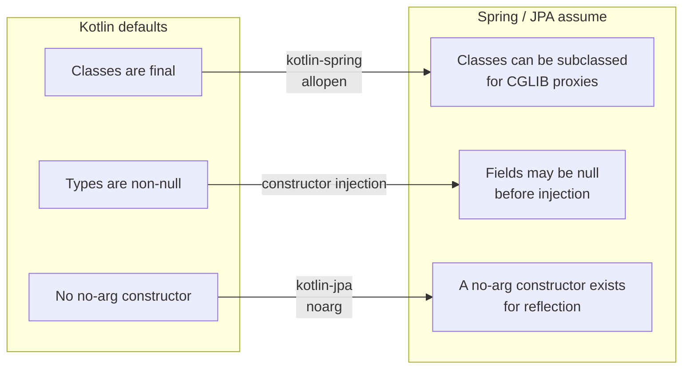

:::info[Prerequisites]
**Layered Architecture** — the DTO and entity types this page is about.
:::

## Two designs meeting in the middle

Spring was built for Java, and it assumes three things Kotlin deliberately doesn't
provide by default:



Two compiler plugins close the gap, and Spring Initializr adds them for you — which
is why most people never learn what they do until something breaks:

```kotlin
plugins {
    kotlin("plugin.spring") version "2.2.0"   // allopen: un-finalises @Component, @Configuration, …
    kotlin("plugin.jpa")    version "2.2.0"   // noarg: synthesises a no-arg constructor for @Entity
}
```

Without `plugin.spring`, `@Transactional` on a `@Service` silently does nothing —
CGLIB can't subclass a final class to build the proxy. Without `plugin.jpa`, Hibernate
can't instantiate your entities at all. If either symptom appears in a project you
didn't scaffold yourself, check the plugin block first.

## Null safety where it actually pays

Kotlin's null safety is a compile-time property, and the JVM boundary is where it
leaks. Two places matter on a backend:

**Deserialised JSON.** Jackson will happily construct a Kotlin object with `null` in
a non-null field via reflection unless the
[`jackson-module-kotlin`](https://github.com/FasterXML/jackson-module-kotlin) module
is registered — Spring Boot registers it automatically when it's on the classpath,
which the Kotlin starter puts there. With it, a missing required field becomes a
deserialisation failure at the edge instead of a `NullPointerException` three layers
in.

**Java libraries.** Types coming from Java are *platform types* (`String!`) — Kotlin
can't know their nullability and won't force you to check. Assign them into an
explicitly typed variable at the boundary, so the check happens where you can still
reason about what a missing value means.

Model optionality honestly in the type, then let the compiler enforce the rest:

```kotlin
data class UpdateProfileRequest(
    val displayName: String,      // required — absent means 400 at the edge
    val bio: String?,             // genuinely optional
)
```

## Data classes for DTOs, plain classes for entities

Data classes are close to perfect for request/response models: concise, immutable,
with `equals`/`hashCode`/`copy` generated.

```kotlin
data class OrderResponse(val id: UUID, val total: Money, val status: String)
```

For **JPA entities** they're a trap, and it's worth knowing why rather than treating
it as a rule:

- Generated `equals`/`hashCode` include every property. Hibernate needs an entity's hash code to be stable across its lifecycle, and a generated id is `null` before the flush and populated after — so an entity put into a `HashSet` before saving becomes unfindable in it afterwards.
- `toString()` includes all properties, so logging an entity traverses lazy associations and fires queries — sometimes a great many.
- `copy()` produces a detached twin carrying the same id, which is not a concept JPA has.

So:

```kotlin
@Entity
class Order(
    @Id val id: UUID = UUID.randomUUID(),   // assigned by the app, not the DB
    @Column(nullable = false) var status: OrderStatus,
) {
    override fun equals(other: Any?) = other is Order && other.id == id
    override fun hashCode() = id.hashCode()
}
```

Assigning the id in the constructor rather than relying on `@GeneratedValue` makes
identity stable from the moment the object exists — which sidesteps the problem
rather than managing it.

## Kotlin features that earn their place here

- **Sealed types for outcomes.** A service returning `sealed interface PlaceOrderResult` with `Success`, `InsufficientStock` and `PaymentDeclined` gives the controller an exhaustive `when`: every branch maps to a status code, and the compiler catches the one you forgot when a case is added. Substantially better than exceptions for *expected* failures.
- **Extension functions for mapping.** `fun Order.toResponse() = OrderResponse(…)` keeps the mapping next to its use site without another `Mapper` bean in the context.
- **`@ConfigurationProperties` on a data class** — typed, immutable configuration; covered on the configuration page.
- **Coroutines**, if you're on WebFlux. On Spring MVC with virtual threads (Boot 3.2+, `spring.threads.virtual.enabled=true`), ordinary blocking code scales without a reactive rewrite — usually the better trade for a CRUD service.

## What to take away

- The Kotlin/Spring friction is entirely about final classes and missing no-arg constructors. Two compiler plugins resolve it, and their absence produces silence rather than errors.
- Null safety pays at the JSON and Java-interop boundaries — the places where nullability is genuinely unknown.
- Data classes for DTOs; plain classes with id-based equality for entities.
- Sealed result types turn expected failures into something the compiler checks.

## References

- [Spring Framework — Kotlin support](https://docs.spring.io/spring-framework/reference/languages/kotlin.html)
- [Kotlin — All-open compiler plugin](https://kotlinlang.org/docs/all-open-plugin.html) and [No-arg compiler plugin](https://kotlinlang.org/docs/no-arg-plugin.html)
- [jackson-module-kotlin](https://github.com/FasterXML/jackson-module-kotlin)
- [Kotlin — Null safety](https://kotlinlang.org/docs/null-safety.html) and [platform types](https://kotlinlang.org/docs/java-interop.html#null-safety-and-platform-types)
- [Spring Boot — Virtual threads](https://docs.spring.io/spring-boot/reference/features/task-execution-and-scheduling.html)
