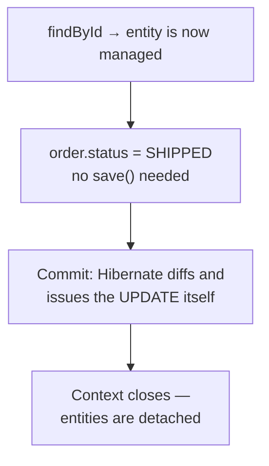

:::info[Prerequisites]
**Kotlin on Spring** — entity design and the `kotlin-jpa` plugin.
:::

## Repositories you don't implement

Spring Data generates the implementation from the interface. Method names are parsed
into queries; anything the parser can't express, you write.

```kotlin
interface OrderRepository : JpaRepository<Order, UUID> {

    fun findByCustomerIdAndStatus(customerId: UUID, status: OrderStatus): List<Order>

    @Query("select o from Order o join fetch o.lines where o.id = :id")
    fun findWithLines(@Param("id") id: UUID): Order?
}
```

Derived queries are excellent up to about three conditions and unreadable past it.
`findByCustomerIdAndStatusAndCreatedAtBetweenOrderByTotalDesc` is a query written in
the worst available syntax — switch to `@Query` well before that point.

## The persistence context

The piece that explains most JPA surprises. Inside a transaction, Hibernate keeps a
**persistence context**: a map of managed entities, acting as a first-level cache and
a change tracker.



Two consequences:

**Dirty checking.** Mutating a managed entity inside a transaction persists the change
at commit, with no `save()` anywhere. This surprises people in both directions: a
mutation you didn't intend to persist gets persisted, and a `save()` you removed
during cleanup turns out not to have mattered.

**Detachment.** After commit the entities are detached, and any association not
already loaded can't be. This is why the controller must not be handed an entity —
by the time Jackson serialises it, the context is gone.

## What `@Transactional` actually promises

```kotlin
@Service
class OrderService(private val repo: OrderRepository) {

    @Transactional
    fun ship(id: UUID) { … }        // one unit of work: all commits or none
}
```

Three things worth knowing precisely:

**It's a proxy.** The annotation only works when the call arrives through the Spring
proxy. A call from *inside the same class* — `this.ship(id)` from another method —
bypasses the proxy entirely and runs with no transaction. No warning, no error. To
fix it, move the method into a different bean.

**Rollback rules aren't what people assume.** Spring rolls back on unchecked
exceptions (`RuntimeException`, `Error`) and *commits* on checked exceptions unless
you say otherwise. In Kotlin every exception is unchecked, so the default is more
intuitive there — but code calling into Java libraries can still trip on it. Be
explicit when it matters: `@Transactional(rollbackFor = [Exception::class])`.

**Put it on the service, not the repository.** The transaction boundary is the
business operation. Debiting one account and crediting another is one unit of work;
two repository-level transactions is exactly the bug transactions exist to prevent.

Use `@Transactional(readOnly = true)` for query paths — it lets Hibernate skip dirty
checking and lets the driver route to a replica if you have one.

:::warning[Keep transactions short]
A transaction holds a connection from the pool. HTTP calls, file uploads, and
`Thread.sleep` inside one are how a service with a 10-connection pool stops
serving traffic at 11 concurrent requests.
:::

## N+1: the default failure

```kotlin
val orders = repo.findByCustomerId(id)          // 1 query
orders.forEach { println(it.lines.size) }       // N more, one per order
```

Lazy loading did exactly what it was told, once per iteration. In development with
five rows it's invisible; in production with 500 it's a 500-query page load.

Fixes, in order of preference:

| Fix | How | When |
| --- | --- | --- |
| `join fetch` | `@Query("select o from Order o join fetch o.lines")` | You know the access pattern for this call site |
| Entity graph | `@EntityGraph(attributePaths = ["lines"])` on the repository method | Same, declaratively, without writing JPQL |
| Batch fetching | `@BatchSize(size = 50)` on the collection | Broad mitigation — turns N queries into N/50 |
| A projection | Interface or DTO projection selecting only needed columns | Read-only endpoints; skips entities altogether |

Two things to be careful of. `join fetch` on **two** collections at once produces a
cartesian product — fetch one collection per query. And `EAGER` fetching is not the
fix: it converts one visible problem into an invisible one that fires on every load
of the entity, everywhere.

**Make it detectable.** Turn on SQL logging in development and assert query counts in
tests; N+1 is a bug you can only see by counting.

```yaml
logging.level.org.hibernate.SQL: DEBUG
spring.jpa.properties.hibernate.generate_statistics: true
```

## Schema changes belong to a migration tool

`spring.jpa.hibernate.ddl-auto` is for local experiments only. Set it to `validate`
in every deployed environment — it then verifies that your entities match the schema
and refuses to start if they don't — and let
[Flyway](https://documentation.red-gate.com/flyway) or
[Liquibase](https://docs.liquibase.com/) own the schema through versioned, reviewed,
ordered migrations.

`ddl-auto: update` against a real database is the setting that silently drops a
column during a deploy. It never removes anything on purpose, which is precisely why
the schema it produces drifts from the one anybody designed.

## What to take away

- The persistence context explains dirty checking, detachment and `LazyInitializationException` — one mechanism, three symptoms.
- `@Transactional` is proxy-based: self-invocation silently does nothing, and the boundary belongs on the business operation.
- N+1 is the default behaviour of lazy associations, not an edge case. Fix at the call site with `join fetch` or an entity graph, and log queries so you can see it.
- Migrations own the schema. `ddl-auto` beyond `validate` is a production incident waiting for a deploy.

## References

- [Spring Data JPA reference](https://docs.spring.io/spring-data/jpa/reference/jpa.html) — [query derivation](https://docs.spring.io/spring-data/jpa/reference/jpa/query-methods.html) and [entity graphs](https://docs.spring.io/spring-data/jpa/reference/jpa/entity-graph.html)
- [Spring Framework — Transaction management](https://docs.spring.io/spring-framework/reference/data-access/transaction.html) and [declarative transaction rollback rules](https://docs.spring.io/spring-framework/reference/data-access/transaction/declarative/rolling-back.html)
- [Hibernate ORM user guide — fetching](https://docs.jboss.org/hibernate/orm/current/userguide/html_single/Hibernate_User_Guide.html#fetching)
- [Flyway documentation](https://documentation.red-gate.com/flyway)
