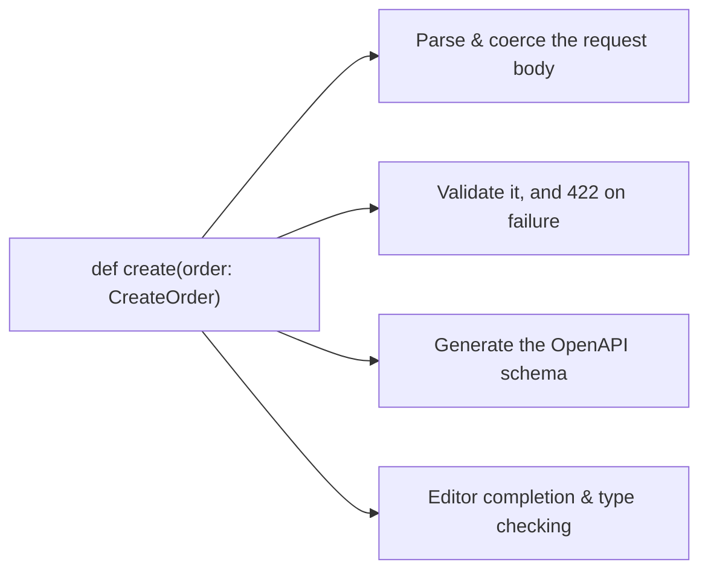

:::info[Prerequisites]
**REST API Design**. Reading **Spring Boot & Kotlin** first is optional but makes the contrasts here land harder.
:::

## Why this chapter exists

FastAPI took a Python feature that was mostly documentation — type hints — and made
it load-bearing. One annotation drives four things at once:

That's the whole design idea. The signature *is* the contract, so the schema can't
drift from the implementation — the drift that makes hand-written OpenAPI documents
untrustworthy within a month.

The framework then gets out of the way. Where Spring auto-configures a database pool,
a serialiser and a web server on your behalf, FastAPI configures a router and leaves
the rest to you. Fewer surprises, more assembly.

## Where it fits

Python is the language the model lives in. When a service has to load a PyTorch
model, call a tokenizer, or run a scikit-learn pipeline, rewriting that in another
language is not a real option — so the API goes where the model already is.

That makes FastAPI the default choice for two distinct jobs, and they have different
constraints:

| Job | Dominant constraint |
| --- | --- |
| CRUD / gateway services | Concurrent I/O — database and upstream HTTP calls |
| Model inference services | CPU or GPU time inside a single request, which blocks everything else |

The async page in this chapter is about the second one, because that's where a Python
service most often falls over in a way that looks inexplicable.

## What's in here

| Page | What it covers |
| --- | --- |
| Pydantic & Typed Models | Validation, coercion, and separating request from response models |
| Async & the Event Loop | `def` vs `async def`, and the blocking call that stalls the whole process |
| Dependencies & Structure | `Depends`, lifespan resources, routers, and settings |
| Serving in Production | ASGI servers, workers, timeouts, and shipping a model behind an endpoint |

## Where this connects

**Authentication & Authorization** is next and uses FastAPI's security utilities for
its examples. In Track 4, **RAG Pipelines** and **Embeddings & Vector Search** are
built as exactly the kind of service this chapter describes — which is where the
inference-specific advice here starts to matter.

## References

- [FastAPI documentation](https://fastapi.tiangolo.com/)
- [Pydantic documentation](https://docs.pydantic.dev/latest/)
- [ASGI specification](https://asgi.readthedocs.io/en/latest/specs/main.html)
