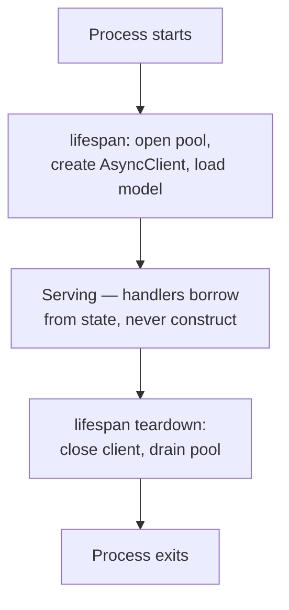

:::info[Prerequisites]
**Async & the Event Loop** — the shared clients and pools here are the ones that must not be created per request.
:::

## `Depends` is dependency injection with a resolver

FastAPI's DI has no container and no annotations on classes. A dependency is a
callable; a handler declares it as a parameter; FastAPI resolves the graph per
request and caches each dependency within that request.

```python
def get_db() -> Iterator[Session]:
    with SessionLocal() as session:
        yield session                      # teardown runs after the response

def current_user(token: str = Depends(oauth2_scheme),
                 db: Session = Depends(get_db)) -> User:
    user = decode_and_load(token, db)
    if user is None:
        raise HTTPException(401, "Invalid credentials")
    return user

@app.get("/orders")
def list_orders(user: User = Depends(current_user),
                db: Session = Depends(get_db)) -> list[OrderResponse]:
    ...
```

Two things carry most of the value:

**Dependencies compose.** `current_user` itself depends on `get_db`, and FastAPI
resolves the whole tree. `get_db` is called **once** per request even though two
places asked for it — the per-request cache is what makes composition safe.

**`yield` gives you teardown.** Code after the `yield` runs once the response is
sent, which is how sessions get closed and transactions ended without a `finally` in
every handler.

In modern code the `Annotated` form reads better and is reusable:

```python
DbSession = Annotated[Session, Depends(get_db)]
CurrentUser = Annotated[User, Depends(current_user)]

@app.get("/orders")
def list_orders(user: CurrentUser, db: DbSession) -> list[OrderResponse]: ...
```

### Dependencies that only guard

When a dependency's job is to raise or pass — a permission check, a rate limiter —
attach it without binding a value:

```python
@router.delete("/orders/{id}", dependencies=[Depends(require_admin)])
def delete_order(id: UUID) -> None: ...
```

The same list works on `APIRouter(...)` and `FastAPI(...)`, applying to every route
beneath it. That's how you make a whole router authenticated in one line rather than
one decorator at a time — and, more importantly, how you stop a new endpoint from
being added without the check.

## Lifespan: things created once, not per request

Connection pools, HTTP clients and ML models are startup concerns. Creating them
inside a handler destroys pooling and, for a model, re-reads gigabytes per request.



```python
@asynccontextmanager
async def lifespan(app: FastAPI):
    app.state.http = httpx.AsyncClient(timeout=5.0)
    app.state.model = load_model(settings.model_path)
    yield
    await app.state.http.aclose()

app = FastAPI(lifespan=lifespan)
```

`lifespan` replaced the older `@app.on_event("startup")` decorators, which are
deprecated — the context manager form exists so setup and its matching teardown sit
in one place instead of two functions that drift apart.

Note that each **worker process** runs `lifespan` separately. Four Uvicorn workers
means four copies of the model in memory, which is the memory calculation people miss
when they scale workers to use more cores.

## Routers and layout

`APIRouter` splits the app by feature. As in the Spring chapter, package by feature
rather than by layer:

```text
app/
  main.py                 # FastAPI(), lifespan, include_router
  config.py               # Settings
  orders/
    router.py             # HTTP: paths, status codes, dependencies
    schemas.py            # Pydantic request/response models
    service.py            # business logic — no FastAPI imports
    repository.py         # data access
  payments/
    …
```

```python
router = APIRouter(prefix="/orders", tags=["orders"])

@router.post("", status_code=201)
def create(payload: CreateOrder, db: DbSession) -> OrderResponse:
    return OrderResponse.model_validate(orders.place(db, payload))

# main.py
app.include_router(orders.router)
```

The constraint worth enforcing: **`service.py` imports nothing from FastAPI.**
Business logic that raises `HTTPException` can only ever be called from an HTTP
handler — not from a worker, a CLI, or a test. Services raise domain errors; the
router maps them to status codes, usually through one `exception_handler`.

## Settings from the environment

```python
class Settings(BaseSettings):
    model_config = SettingsConfigDict(env_file=".env")

    database_url: PostgresDsn
    api_key: SecretStr
    request_timeout_s: float = 5.0

@lru_cache
def get_settings() -> Settings: return Settings()
```

`pydantic-settings` reads environment variables, validates and coerces them into
types, and fails at import time if something required is missing — the same
"misconfiguration is a startup failure" property as `@ConfigurationProperties`.

`SecretStr` is worth using for credentials: its `repr` prints `**********`, so a
secret can't reach a log through an accidental f-string or a traceback.

Wrapping it in `get_settings` as a dependency rather than a module-level global means
tests can override it via `app.dependency_overrides` — which is also the cleanest way
to swap the database or an upstream client in tests.

## What to take away

- `Depends` composes and caches per request; `yield` dependencies give you teardown after the response.
- Use dependency lists on routers for guards, so a new endpoint can't be added without the check.
- Pools, clients and models are created in `lifespan` — once per process, not once per request.
- Keep FastAPI imports out of the service layer, or the logic can only ever be reached over HTTP.

## References

- [FastAPI — Dependencies](https://fastapi.tiangolo.com/tutorial/dependencies/), [with `yield`](https://fastapi.tiangolo.com/tutorial/dependencies/dependencies-with-yield/), and [for routers](https://fastapi.tiangolo.com/tutorial/bigger-applications/)
- [FastAPI — Lifespan events](https://fastapi.tiangolo.com/advanced/events/)
- [FastAPI — Testing dependency overrides](https://fastapi.tiangolo.com/advanced/testing-dependencies/)
- [pydantic-settings](https://docs.pydantic.dev/latest/concepts/pydantic_settings/)
