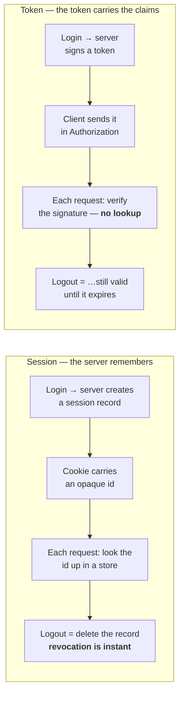

:::info[Prerequisites]
**Authentication & Authorization** — the 401/403 split.
:::

## HTTP forgets, so something has to remember

HTTP is stateless: each request arrives with no knowledge of the last. Every auth
design is an answer to "how does request #2 know it's the same person as request #1",
and there are exactly two shapes of answer.



Everything else is a consequence of that one difference: **stateful lookup vs
self-contained claims.**

| | Session (stateful) | Token (stateless) |
| --- | --- | --- |
| Per-request cost | A store lookup | A signature verification |
| Revocation | Immediate — delete the record | Hard; valid until expiry unless you add state back |
| Scaling | Shared store (Redis) or sticky sessions | Nothing to share |
| Cross-origin / mobile | Cookie rules make it awkward | Natural — it's just a header |
| Size on the wire | Small opaque id | Hundreds of bytes to a few KB, every request |
| Data freshness | Read fresh each request | Frozen at issue time — a revoked role stays in the token |

## Which one to pick

The honest version, because both get oversold:

**Sessions are underrated.** For a single web application with a browser frontend on
the same site, a session cookie is simpler, smaller, and gives you instant
revocation for free. "Stateless is more scalable" is a real argument at a scale most
services never reach — and a Redis lookup is sub-millisecond.

**Tokens earn their keep** when the frontend and API are on different origins (which
is the case for a static site calling a separate backend), when there's a mobile
client, when several services must verify identity without sharing a session store,
or when a third party is calling on a user's behalf. Then a bearer token in a header
is genuinely simpler than making cookies work.

Many production systems run both: a session cookie for the first-party web app, and
tokens for the API and mobile clients.

## Cookies, if you use them

Three attributes, and a missing one is a vulnerability rather than an oversight:

```http
Set-Cookie: sid=…; HttpOnly; Secure; SameSite=Lax; Path=/; Max-Age=1209600
```

- **`HttpOnly`** — JavaScript can't read it, so an XSS bug can't exfiltrate the session directly.
- **`Secure`** — HTTPS only. Without it the cookie travels in cleartext on any accidental plain-HTTP request.
- **`SameSite`** — `Lax` blocks the cookie on cross-site subrequests, which removes most CSRF. `Strict` is stronger and breaks inbound links from other sites. `None` requires `Secure` and puts CSRF protection entirely back on you.

Sessions still need a **CSRF defence** for state-changing requests, because the
browser attaches the cookie automatically — that's the whole attack. `SameSite=Lax`
plus a per-session CSRF token on unsafe methods is the standard pairing. Token-in-header
auth doesn't have this problem, since nothing attaches the header for you.

Rotate the session id on login and on privilege change. Without that, an attacker who
can plant a known id before login (session fixation) inherits the authenticated
session.

## Where to put a token in a browser

The question that produces the most bad advice. The options:

| Storage | XSS exposure | CSRF exposure | Notes |
| --- | --- | --- | --- |
| `localStorage` | Readable by any script on the page | None | The common choice; an XSS bug is a full account takeover |
| In-memory (a JS variable) | Only while the page is open | None | Lost on refresh — needs a refresh mechanism |
| `HttpOnly` cookie | Not readable by script | Yes — needs `SameSite` + CSRF token | Best of both, if same-site works for you |

The realistic summary: `localStorage` is not "secure" in any strong sense, and the
mitigation is preventing XSS rather than moving the token. If you can use a cookie
(same site, browser client), do — you get `HttpOnly` and pay with CSRF handling,
which is a well-understood, solved problem. If you can't, keep tokens short-lived so
a stolen one has a small window.

## Password storage, briefly

If you store passwords at all — and consider whether you must, rather than federating
to an identity provider:

- **Argon2id** is the current first recommendation; **bcrypt** remains acceptable for existing systems. Never a bare SHA/MD5 hash, with or without salt: those are designed to be fast, which is exactly the wrong property.
- Salt per password (every modern library does this for you), and store the algorithm parameters with the hash so they can be raised later.
- Compare in constant time, and return the same response for "no such user" and "wrong password" — the difference is a user-enumeration oracle.
- Follow [NIST SP 800-63B](https://pages.nist.gov/800-63-3/sp800-63b.html) on policy: check candidate passwords against known-breached lists, allow long passphrases, and drop mandatory periodic rotation, which measurably makes passwords worse.

## What to take away

- Sessions look identity up; tokens carry it. Revocation, scaling and cross-origin behaviour all follow from that.
- Sessions are the better default for a same-site web app; tokens for split origins, mobile, and service-to-service.
- Cookie auth is safe with `HttpOnly`, `Secure`, `SameSite` and a CSRF token — all four, not three.
- No browser storage protects a token from XSS. Short lifetimes limit the damage; preventing XSS is the actual control.

## References

- [OWASP — Session Management Cheat Sheet](https://cheatsheetseries.owasp.org/cheatsheets/Session_Management_Cheat_Sheet.html) and [CSRF Prevention](https://cheatsheetseries.owasp.org/cheatsheets/Cross-Site_Request_Forgery_Prevention_Cheat_Sheet.html)
- [OWASP — Password Storage Cheat Sheet](https://cheatsheetseries.owasp.org/cheatsheets/Password_Storage_Cheat_Sheet.html)
- [MDN — `Set-Cookie` and `SameSite`](https://developer.mozilla.org/en-US/docs/Web/HTTP/Headers/Set-Cookie/SameSite)
- [NIST SP 800-63B — Digital Identity Guidelines: Authentication](https://pages.nist.gov/800-63-3/sp800-63b.html)
