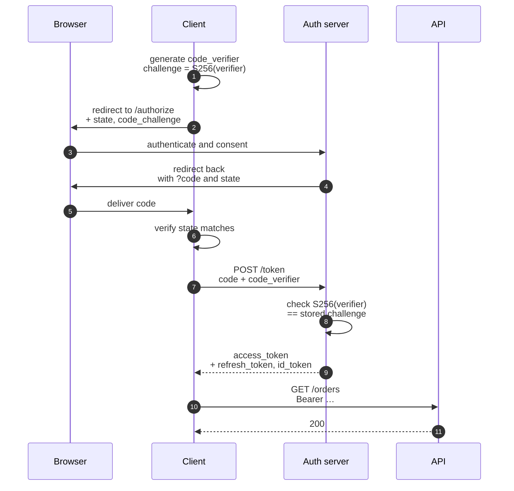

:::info[Prerequisites]
**Sessions & Tokens** — OAuth is a way of *obtaining* the token described there.
:::

## OAuth 2.0 is delegated authorization, not login

The most useful correction first: **OAuth 2.0 is not an authentication protocol.** It
was designed so a user can let an application access a resource on their behalf
without handing over their password. The output is an access token representing a
*grant*, not a statement about who the user is.

Using an OAuth access token as proof of identity is a known mistake with a known
consequence — the token doesn't say who it was issued to, so an application can
present a token obtained for a different client and be accepted. **OpenID Connect**
exists precisely to fill that gap, and is covered below.

The four roles:

| Role | Who it is |
| --- | --- |
| Resource owner | The user |
| Client | The application acting on their behalf |
| Authorization server | Issues tokens — Auth0, Okta, Keycloak, Google, Supabase |
| Resource server | Your API, which validates the token |

## Authorization Code + PKCE: the flow to use

For anything with a user in front of it — web app, SPA, mobile app — this is the
answer. [RFC 9700](https://www.rfc-editor.org/rfc/rfc9700.html) recommends PKCE for
*all* clients now, not only public ones.



Why each part exists:

- **The code, not the token, comes back through the browser.** A URL ends up in history, logs and `Referer` headers; a short-lived, single-use code there is far less damaging than an access token.
- **PKCE** ([RFC 7636](https://www.rfc-editor.org/rfc/rfc7636.html)) binds the code to the client that started the flow. An attacker who intercepts the code can't redeem it without the `code_verifier`, which never left the client. Use `S256`; the `plain` method provides no protection.
- **`state`** is a CSRF defence for the flow itself: the client generates it, checks it on return, and rejects a callback it didn't initiate.
- **Exact-match redirect URIs**, registered in advance. Wildcard or prefix matching is how codes get redirected to an attacker's host — it is one of the most exploited misconfigurations in OAuth deployments.

## Client Credentials: no user involved

Service-to-service. The client is the resource owner, so there's no redirect and no
browser.

```http
POST /token
grant_type=client_credentials&scope=orders:read
Authorization: Basic <client_id:client_secret>
```

Use it for backend jobs and machine clients. It must never be used from a browser or
mobile app, because there is nowhere in either to keep a client secret — anything
shipped to a user's device is public by definition.

## The deprecated flows, and why

RFC 9700 formally deprecates two grants you will still find in older tutorials:

- **Implicit** (`response_type=token`) returned the access token directly in the URL fragment. It existed because browsers couldn't make cross-origin token requests; CORS solved that years ago. The token ends up in browser history and is exposed to any script on the page. Use Authorization Code + PKCE instead.
- **Resource Owner Password Credentials** had the app collect the user's actual password and exchange it. It defeats the entire point of OAuth, makes federation and MFA impossible, and trains users to type their credentials into third-party UIs.

RFC 9700 also rules out **bearer tokens in query strings**: they leak through logs,
proxies and `Referer`. The `Authorization` header is the only correct place.

## What OpenID Connect adds

[OIDC](https://openid.net/specs/openid-connect-core-1_0.html) is a thin identity layer
on top of OAuth 2.0. It adds three things that turn "this app may act on someone's
behalf" into "this is who the user is":

1. **The ID token** — a JWT *about the user*, for the client, with a defined claim set (`sub`, `iss`, `aud`, `exp`, `iat`, `nonce`, plus profile claims). Critically, `aud` names the client, so a token minted for a different app fails validation.
2. **A `/userinfo` endpoint** for profile claims, so they don't all have to ride in the token.
3. **Discovery** at `/.well-known/openid-configuration` — endpoints, supported algorithms and the JWKS URI, so clients configure themselves instead of hardcoding URLs.

The distinction that matters in day-to-day code:

| Token | Audience | Purpose | Send it to your API? |
| --- | --- | --- | --- |
| **ID token** | The client app | Tells the app who the user is | **No** — it isn't scoped to your API |
| **Access token** | The resource server (your API) | Authorises the call | Yes, as a bearer token |

Sending an ID token to your API is a common shortcut and a real weakness: the API
then accepts a token whose audience is some other application. Your API validates
**access tokens**, and checks that `aud` names it.

## Scopes are not permissions

`scope=orders:read` says what the *user allowed the client to do*. It doesn't say the
user is permitted to read those orders. A token with `orders:read` still must not
return an order belonging to someone else — that check is yours, on every request,
and it's the subject of the authorization-models page.

Scopes narrow a grant. They never widen a user's rights.

## What to take away

- OAuth 2.0 delegates authorization; OIDC layers identity on top. Access tokens go to your API, ID tokens do not.
- Authorization Code + PKCE with `state` and exact-match redirect URIs is the flow for user-facing clients; client credentials for machines.
- Implicit and password grants are deprecated by RFC 9700, along with tokens in query strings.
- A scope is a ceiling on what a client may attempt, never evidence that the user may do it.

## References

- [RFC 6749 — The OAuth 2.0 Authorization Framework](https://www.rfc-editor.org/rfc/rfc6749.html) and [RFC 6750 — Bearer Token Usage](https://www.rfc-editor.org/rfc/rfc6750.html)
- [RFC 9700 — Best Current Practice for OAuth 2.0 Security](https://www.rfc-editor.org/rfc/rfc9700.html) (BCP 240)
- [RFC 7636 — PKCE](https://www.rfc-editor.org/rfc/rfc7636.html)
- [OpenID Connect Core 1.0](https://openid.net/specs/openid-connect-core-1_0.html) and [Discovery 1.0](https://openid.net/specs/openid-connect-discovery-1_0.html)
- [oauth.net — OAuth 2.0 Security Best Current Practice](https://oauth.net/2/oauth-best-practice/)
