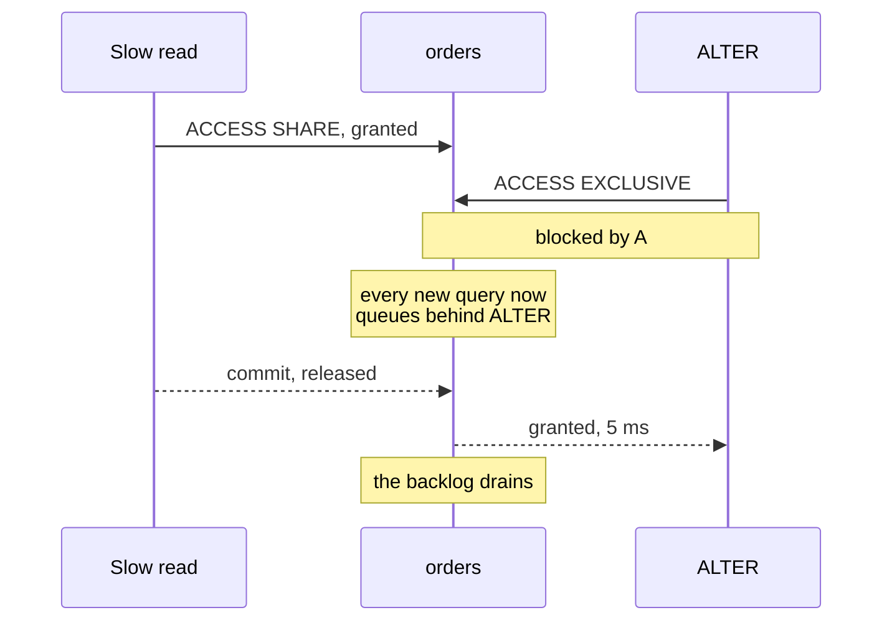

:::info[Prerequisites]
**Indexing & Query Plans** — `CREATE INDEX CONCURRENTLY` shows up here again, for
the same reason.
:::

## Two rules the rest of the page follows from

**1. The migration and the code deploy are not simultaneous.** However fast your
pipeline is, there is a window where old application code is talking to the new
schema, or new code to the old one. Every safe migration is designed so that both
combinations work.

**2. A fast statement can still cause an outage.** DDL that finishes in 5ms can take
the site down for 30 seconds, because the problem isn't the duration of the
statement — it's the lock queue in front of it.

## The lock queue

`ALTER TABLE` takes an `ACCESS EXCLUSIVE` lock, which conflicts with everything,
including plain `SELECT`s. PostgreSQL's lock queue is ordered, so a lock request
that has to wait also **blocks every request behind it**:



One slow reporting query holds `ACCESS SHARE`. The `ALTER` queues behind it. Every
query that arrives after that queues behind the `ALTER` — so a five-millisecond
migration is unavailable for as long as the *reporting query* runs, and the outage
looks nothing like the change that caused it.

The mitigation is to refuse to wait:

```sql
set lock_timeout = '3s';
alter table orders add column priority integer;
```

If the lock isn't acquired within three seconds the statement fails, having blocked
nothing, and you retry later. This one line converts "unexplained site outage" into
"the migration didn't apply" — a much better failure. Wrap DDL in it as a matter of
habit, and check for long-running transactions before deploying.

## Which operations are cheap

The lock is unavoidable; a **table rewrite** underneath it is what makes the lock
long. Modern PostgreSQL avoids the rewrite in more cases than its reputation
suggests.

| Operation | Cost |
| --- | --- |
| `ADD COLUMN` (nullable, or with a non-volatile default) | Metadata only, since PostgreSQL 11 |
| `DROP COLUMN` | Metadata only; the space is reclaimed lazily |
| `ADD COLUMN ... DEFAULT random()` | **Full rewrite** — volatile default needs a value per row |
| Type change (e.g. `integer` → `bigint`) | **Full rewrite** |
| `varchar(50)` → `varchar(100)` or → `text` | Metadata only |
| `SET NOT NULL` | Full scan — unless a validated `CHECK` already proves it |
| `ADD CONSTRAINT` / foreign key | Full scan — unless declared `NOT VALID` |
| `CREATE INDEX` | Blocks writes — use `CONCURRENTLY` |

The two `NOT VALID` cases are the important escape hatch. The pattern is the same
for both: register the rule cheaply, then verify the existing rows under a weaker
lock.

```sql
-- Making a populated column NOT NULL without a long exclusive lock
alter table orders add constraint priority_not_null
    check (priority is not null) not valid;   -- instant; enforced for new rows

alter table orders validate constraint priority_not_null;   -- scans, allows reads and writes

alter table orders alter column priority set not null;      -- uses the check, no second scan
alter table orders drop constraint priority_not_null;
```

## Backfills

Never backfill in a single `UPDATE`. A statement touching ten million rows holds
its locks and its transaction open for the duration, and — because that transaction
is old — it prevents `VACUUM` from cleaning up anywhere in the database, so bloat
accumulates while it runs.

Batch instead, committing each batch:

```sql
-- repeat until zero rows updated
update orders set priority = 3
where id in (
    select id from orders where priority is null limit 5000
);
```

Run it from a script with a short pause between batches, and make it **resumable** —
the `WHERE priority IS NULL` predicate above means re-running it after a failure
picks up where it stopped, with no bookkeeping. A partial index on the unfilled
rows keeps the batch selection fast as the remainder shrinks.

## Expand and contract

The pattern for any change that can't be made atomically — renaming a column,
splitting one column into two, changing a type. Instead of one destructive step,
several additive ones, each safe on its own:

| Phase | Schema | Application |
| --- | --- | --- |
| **Expand** | Add the new column | Unchanged |
| **Dual-write** | Both columns exist | Writes both, reads the old one |
| **Backfill** | Both columns exist | Historical rows filled in batches |
| **Switch** | Both columns exist | Reads the new one, still writes both |
| **Contract** | Drop the old column | Writes only the new one |

Every phase is independently deployable and independently revertible, which is the
entire point: at no moment does a rollback of the application require a rollback of
the schema. The price is that a rename takes five deploys instead of one, and
consequently that people skip it — which is fine for a table nobody reads and a
production incident for one that everything reads.

Leave real time between the switch and the contract. Dropping the old column the
same afternoon defeats the purpose, since the safety came from being able to roll
the application back to a version that still read it.

## Practical notes

- **Migrations are append-only.** Never edit a migration that has run anywhere. Tools track applied migrations by checksum; changing one leaves environments silently divergent, and the drift is only discovered later, by something else breaking.
- **Down migrations mostly don't work.** They're rarely tested and cannot undo a `DROP COLUMN` — the data is gone. Plan to roll *forward* with a new migration, and treat destructive changes as needing a real backup rather than a reversal script.
- **PostgreSQL DDL is transactional.** Several `ALTER`s in one migration either all apply or none do, which is a genuine advantage over MySQL. The exceptions are `CREATE INDEX CONCURRENTLY` and a few others that must run outside a transaction block — most migration tools have a flag for this.
- **Separate the migration from the deploy** in your pipeline, so a schema change can be applied and observed before the code that depends on it ships. Coupling them into one step is what forces the simultaneity that rule 1 says doesn't exist.
- **Test against production-shaped data.** A migration that takes 40ms against 200 seeded rows tells you nothing about the same statement against 200 million. Restore a recent backup into a staging database and time it there.

## What to take away

- The danger in DDL is the lock queue, not the statement. Set `lock_timeout` and retry rather than blocking a table behind a slow reader.
- Know which operations rewrite the table; `NOT VALID` plus `VALIDATE CONSTRAINT` avoids the long lock for constraints and `SET NOT NULL`.
- Backfill in committed, resumable batches — a single giant `UPDATE` blocks `VACUUM` across the whole database.
- Expand/contract turns any breaking change into a sequence of independently revertible ones, with a deliberate gap before the destructive step.
- Migrations are append-only and roll forward; a `DROP COLUMN` has no undo.

## References

- [PostgreSQL — Explicit Locking](https://www.postgresql.org/docs/current/explicit-locking.html) — the lock conflict matrix, and why `ACCESS EXCLUSIVE` blocks `SELECT`
- [PostgreSQL — `ALTER TABLE`](https://www.postgresql.org/docs/current/sql-altertable.html), which documents exactly which forms require a rewrite
- [PostgreSQL — Routine Vacuuming](https://www.postgresql.org/docs/current/routine-vacuuming.html) on why long transactions cause bloat
- [Flyway documentation](https://documentation.red-gate.com/flyway) · [Liquibase](https://docs.liquibase.com/) · [Alembic](https://alembic.sqlalchemy.org/)
- [Martin Fowler — Parallel Change](https://martinfowler.com/bliki/ParallelChange.html), the general form of expand/contract
