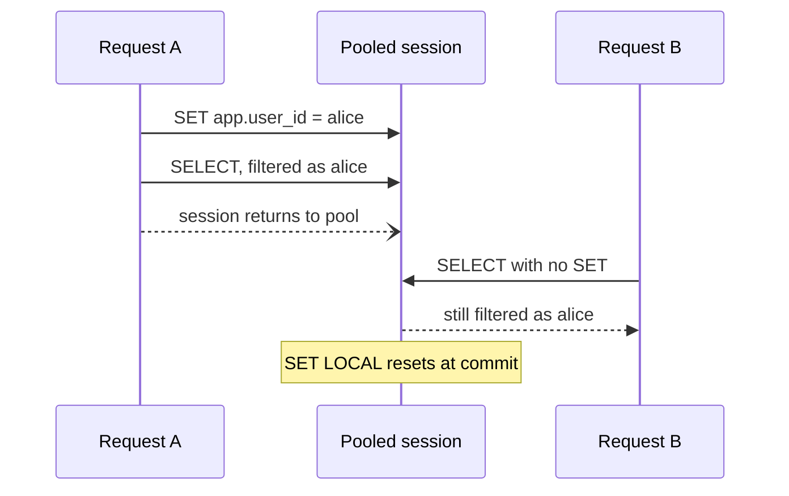

:::info[Prerequisites]
**Policies & Roles** — this page assumes you can write a policy and know why
`SET LOCAL` was emphasised.
:::

## Three ways to isolate tenants

Multi-tenancy is where RLS earns its keep, but it's one of three options and not
always the right one.

| Strategy | Isolation | Cost of a migration | Scales to |
| --- | --- | --- | --- |
| **Shared tables + `tenant_id` + RLS** | Logical, enforced by policy | One migration, all tenants | Millions of tenants |
| **Schema per tenant** | Separate namespaces, one database | Run per schema | Hundreds to low thousands |
| **Database per tenant** | Physical | Run per database, orchestrated | Tens to hundreds |

**Shared tables** is the default for anything self-serve. One connection pool, one
migration, one set of statistics for the planner. The isolation is only as good as
the policies, which is precisely why the policies go in the database rather than in
each query.

**Schema per tenant** looks appealing — real namespace separation, easy per-tenant
export — and degrades in a specific way: every migration becomes a loop over N
schemas, partially-applied states become possible, and the system catalogues grow
large enough to slow down connection setup and planning. It's a reasonable fit for
a B2B product with a few hundred enterprise customers, and a poor one for
self-serve signup.

**Database per tenant** is what regulated or contractually-isolated customers
sometimes require. Real physical isolation; the operational cost is proportional to
tenant count, so it's usually offered as a premium tier alongside a shared cluster
rather than as the only architecture.

These combine. A common shape is shared tables for the long tail plus a dedicated
database for the handful of customers whose contract demands one.

## The connection pooling trap

If you take one operational detail from this chapter, take this one.

Application servers pool connections, and poolers like PgBouncer in transaction
mode reuse one PostgreSQL session across many requests. A plain `SET` persists for
the session's lifetime — well past the request that issued it:



Request B gets Alice's rows. Nothing errors, nothing is logged, and the bug is
load-dependent — it only appears when two requests actually share a session, which
is rare in development and constant in production.

The fix is mechanical: **open a transaction, `SET LOCAL`, query, commit**, with no
path that queries outside a transaction.

```python
async with pool.acquire() as conn, conn.transaction():
    await conn.execute("select set_config('app.user_id', $1, true)", user_id)
    rows = await conn.fetch("select * from documents")
```

`set_config(..., true)` is the function form of `SET LOCAL`, and the one to use
because the value can be parameterised — string-interpolating a user id into a
`SET` statement is a SQL injection hole in the one place you least want one.

Put this in a single helper that every request handler uses, and make the raw pool
inaccessible to application code. An identity-carrying connection that anything can
open without setting the identity is not a safety mechanism.

## Keeping policies fast

Every query against a protected table gets the policy expression bolted on as an
extra predicate, and it's evaluated **per row** unless PostgreSQL can hoist it.
Three things matter:

**Index the column the policy filters on.** A policy on `tenant_id` with no index
on `tenant_id` turns every query into a sequential scan plus a filter. Put
`tenant_id` first in composite indexes too — it's an equality predicate present in
literally every query, which is exactly what a leading column is for.

**Hoist function calls out of the row loop.** A policy calling a function directly
re-evaluates it per row. Wrapping it in a scalar subquery lets the planner evaluate
it once as an InitPlan:

```sql
-- Re-evaluated for every row
using (tenant_id = current_tenant_id())

-- Evaluated once per query
using (tenant_id = (select current_tenant_id()))
```

On large tables the difference is order-of-magnitude, and it's the single most
common RLS performance complaint.

**Scope policies with `TO`.** A policy without a role clause is considered for every
role, including ones that will never match. Naming the role skips the evaluation
entirely.

For a tenant whose data dwarfs everyone else's, **partitioning by `tenant_id`** adds
partition pruning on top of the policy, so other tenants' partitions aren't touched
at all. Worth it at the point where one table is genuinely too large, not before.

## Proving isolation holds

A policy you haven't tested is a policy you hope is correct. The test that matters
is not "Alice sees her documents" — it's "Bob sees zero of Alice's", and it should
exist for every protected table.

```sql
-- as the application role, in a transaction
set local app.user_id = 'bob-uuid';
select count(*) from documents where owner_id = 'alice-uuid';   -- must be 0
insert into documents (owner_id, title) values ('alice-uuid', 'x'); -- must error
```

Both halves are necessary: the first proves `USING`, the second proves `WITH CHECK`.
Run them as the *application* role, not as the owner or as a superuser, or the test
proves nothing at all — this is the most common way an RLS test suite passes while
the system is wide open.

Then guard against the table nobody remembered to protect. RLS is opt-in per table,
so a new table added six months from now ships unprotected by default. Assert it in
CI:

```sql
select relname from pg_class c
join pg_namespace n on n.oid = c.relnamespace
where n.nspname = 'public' and c.relkind = 'r' and not c.relrowsecurity;
```

Any row returned is a table that a migration created and left open. Failing the
build on a non-empty result costs nothing and catches the failure mode that
policy-writing discipline cannot.

## Practical notes

- **Keep the application check too.** RLS returning zero rows produces a `404` with no explanation. The application-layer check produces a `403` that says why. Defence in depth here also means better errors.
- **`tenant_id` on every table, denormalized deliberately.** A policy that has to join to find the tenant is slow and hard to index. Carrying `tenant_id` on child tables duplicates a fact — accept it, and enforce consistency with a composite foreign key on `(tenant_id, parent_id)`.
- **Background jobs need an identity too.** A worker connecting as a `BYPASSRLS` role is a reasonable choice for a job that legitimately spans tenants, and a disaster for one that shouldn't. Decide per job, and prefer setting the tenant explicitly where you can.
- **Watch for the migration role in production paths.** The role that runs migrations needs `BYPASSRLS`; the role the application uses must not have it. Two roles, two connection strings, and a startup assertion that the application's role isn't privileged.

## What to take away

- Shared tables with `tenant_id` and RLS is the default; schema- and database-per-tenant buy stronger isolation at a migration and operations cost proportional to tenant count.
- Behind a transaction-mode pooler, plain `SET` leaks identity between requests. Transaction plus `set_config(..., true)`, in one helper, with no other way to get a connection.
- Index the policy column, hoist function calls into a scalar subquery, and scope policies with `TO`.
- Test the negative case as the application role, and fail CI on any table in the schema without RLS enabled.

## References

- [PostgreSQL — Row Security Policies](https://www.postgresql.org/docs/current/ddl-rowsecurity.html) and [`set_config`](https://www.postgresql.org/docs/current/functions-admin.html#FUNCTIONS-ADMIN-SET)
- [PgBouncer — pooling modes](https://www.pgbouncer.org/features.html) — which server-side state is and isn't safe in transaction mode
- [Supabase — RLS performance recommendations](https://supabase.com/docs/guides/troubleshooting/rls-performance-and-best-practices-Z5Jjwv)
- [PostgreSQL — Table Partitioning](https://www.postgresql.org/docs/current/ddl-partitioning.html)
