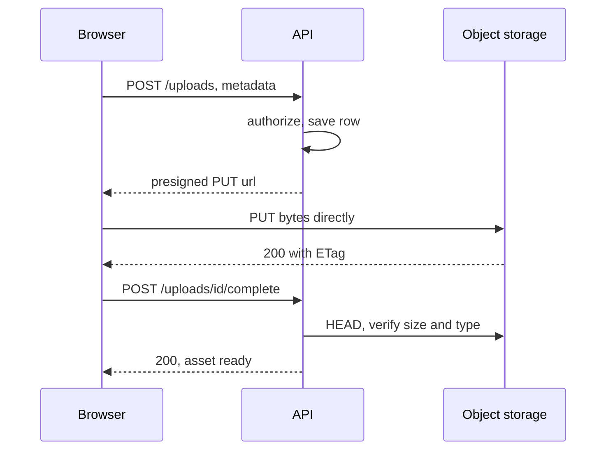

:::info[Prerequisites]
**The Object Storage Model** — keys, immutability and the request-based cost model.
:::

## Don't proxy the bytes

The obvious upload design routes the file through your API: browser posts to
`/upload`, the service receives it, then writes it to the bucket. It works, and it
scales badly for reasons that all show up at once.

A request handler holding a 500 MB upload occupies a worker, a connection and a
buffer for the duration of a client's slow connection. Body size limits get raised,
timeouts get raised, memory grows, and one user on hotel Wi-Fi can hold a worker for
four minutes. You are also paying for the bytes twice — inbound to your compute,
then outbound to storage.

The fix is to let the client talk to the object store directly, with your API
issuing a **presigned URL**: a normal URL carrying a signature that grants one
specific operation, on one specific key, for a limited time.



Your service handles two small JSON requests and never touches the file. The store
absorbs the bandwidth, which is the thing it is extremely good at.

Note what the API is still doing in step 2: authorizing, and choosing the key. The
client never picks its own key — that would let one user overwrite another's object
— and it never uploads without a row existing first, which is what makes the
completion step meaningful.

## Signing correctly

```python
url = s3.generate_presigned_url(
    "put_object",
    Params={
        "Bucket": bucket,
        "Key": key,                          # chosen by the server
        "ContentType": declared_type,        # binds the URL to one type
    },
    ExpiresIn=900,                           # 15 minutes
)
```

Four things to get right:

**Short expiry.** A presigned URL is a bearer credential: anyone holding it can
perform that operation. Minutes, not days. SigV4 caps expiry at seven days, and if
the URL was signed with temporary credentials (an IAM role — normally the case on
managed compute) it also stops working when those credentials rotate, which is
usually much sooner. A URL that mysteriously expires "early" is almost always this.

**Bind the constraints into the signature.** Any parameter included in the signing
is enforced by the store. `ContentType` in the signature means an upload declaring
something else is rejected.

**Limit the size at the store, not just in your handler.** A presigned `PUT` cannot
carry a size limit; a **presigned POST policy** can, via a `content-length-range`
condition. If untrusted clients are uploading, that difference decides which one you
use — otherwise a valid URL is an invitation to write a 5 TB object.

**Configure CORS on the bucket** for browser uploads, or the preflight fails and
the error surfaces as an opaque network failure with no useful message.

## Large files: multipart and resumability

Above a few hundred megabytes, a single `PUT` becomes a bad bet — one dropped
connection loses the whole transfer. **Multipart upload** splits the object into
parts that upload independently, in parallel, and retry individually.

| Constraint (S3) | Value |
| --- | --- |
| Minimum part size | 5 MiB (except the final part) |
| Maximum parts | 10,000 |
| Maximum object size | 5 TiB |
| Maximum single `PUT` | 5 GiB |

The flow is initiate → upload parts (each can be presigned separately) → complete
with the list of part numbers and ETags. It's also how resumable uploads work: the
parts already accepted stay accepted, so a client that reconnects re-uploads only
what's missing.

The trap is the failure path. An upload that is initiated and never completed leaves
its parts stored and billed, invisible to a normal listing. The lifecycle rule to
abort incomplete uploads — mentioned in the previous page — is what makes multipart
safe to use casually. Google Cloud Storage offers resumable uploads with a session
URI as its equivalent mechanism, with the same "clean up abandoned sessions"
requirement.

## Validating what actually arrived

The client told you it was uploading a 2 MB PNG. The client is not a source of truth
about either claim.

After the completion call, `HEAD` the object and check the real size and type
against the pending row. For anything where the content matters, do the real
inspection asynchronously — sniff the actual format from magic bytes rather than
trusting the extension or the declared `Content-Type`, and run the scanning or
transcoding you need — then flip the row to `ready`. Nothing serves the object until
that happens.

This is the point of the pending/ready split: an object exists but is not yet a
usable asset, and the database knows the difference. It also gives virus scanning
and thumbnail generation somewhere natural to hook in, which is
**Decoupling Storage from Services**.

Two content-specific hazards worth naming, because both are routinely missed:

- **SVG uploads are executable.** An SVG can contain script, so serving one from
  your own origin is stored XSS. Serve user-uploaded content from a separate domain,
  and send `Content-Disposition: attachment` and
  `X-Content-Type-Options: nosniff` where you can.
- **Never reflect the user's filename into the key.** Path traversal, unicode
  normalisation and case-collision bugs all live there. Generate the key; keep the
  original name as data.

## Serving reads

The same logic runs in reverse: don't stream bytes through your service to deliver
them.

- **Public, cacheable content** — put a CDN in front of the bucket. The bucket stays
  private; the CDN is the only principal allowed to read it (CloudFront origin
  access control, or the equivalent).
- **Private content** — issue a short-lived presigned `GET`, or use signed CDN URLs
  or cookies so you keep the CDN's caching. Your API returns a redirect or a JSON
  document containing the URL; the browser fetches the bytes from the edge.
- **Range requests** work directly against the store, which is what makes video
  seeking and partial downloads work without any code from you.

Set caching headers at upload time (`Cache-Control` is object metadata), and make
keys **content-addressed or versioned** if objects can be replaced — a key like
`avatars/{user}/{hash}.jpg` can be cached forever and is never stale, whereas
`avatars/{user}.jpg` needs cache invalidation that will eventually go wrong.

## What to take away

- Never proxy uploads or downloads through your service; presigned URLs put the bytes on the path built for them.
- The server picks the key and creates the pending row first. Client-chosen keys are an overwrite vulnerability.
- Sign short, bind `ContentType` into the signature, and use a presigned POST policy when you need a size limit.
- Multipart for large files, plus a lifecycle rule aborting incomplete uploads — otherwise you pay for parts you can't see.
- Verify size and type server-side after upload, and only then mark the asset ready.

## References

- [Amazon S3 — Sharing objects with presigned URLs](https://docs.aws.amazon.com/AmazonS3/latest/userguide/ShareObjectPreSignedURL.html) and [browser-based uploads using POST policies](https://docs.aws.amazon.com/AmazonS3/latest/API/sigv4-HTTPPOSTConstructPolicy.html)
- [Amazon S3 — Uploading and copying objects using multipart upload](https://docs.aws.amazon.com/AmazonS3/latest/userguide/mpuoverview.html) · [S3 CORS configuration](https://docs.aws.amazon.com/AmazonS3/latest/userguide/cors.html)
- [Google Cloud Storage — Resumable uploads](https://cloud.google.com/storage/docs/resumable-uploads)
- [Amazon CloudFront — Restricting access with origin access control](https://docs.aws.amazon.com/AmazonCloudFront/latest/DeveloperGuide/private-content-restricting-access-to-s3.html)
- [OWASP — File Upload Cheat Sheet](https://cheatsheetseries.owasp.org/cheatsheets/File_Upload_Cheat_Sheet.html)
