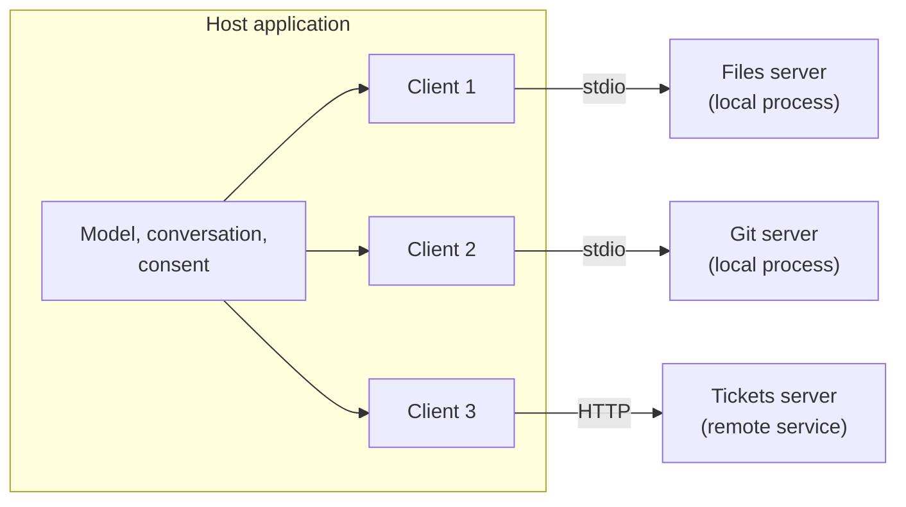
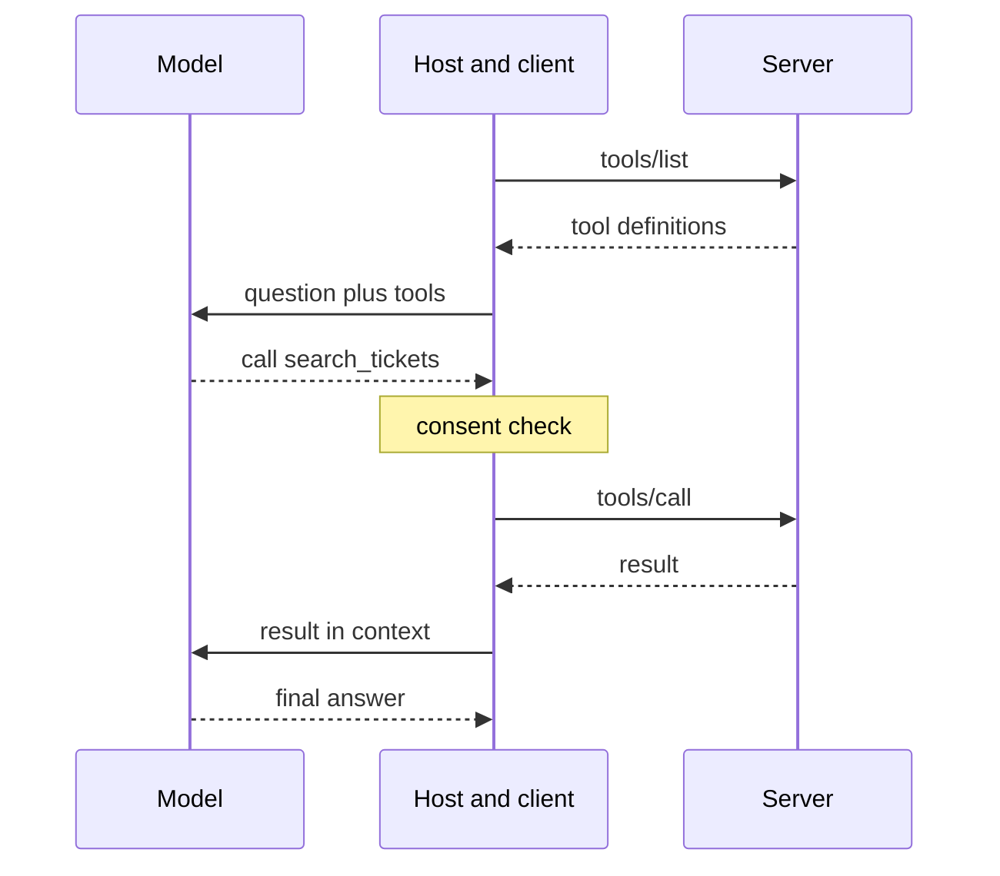

:::info[Prerequisites]
**What MCP Is & Why It Exists** — the N × M problem and the vocabulary.
:::

## Three roles

MCP names three participants. Their names suggest a two-party client/server split, but
the host is the one that matters most:

| Role | What it is | What it owns |
| --- | --- | --- |
| **Host** | The AI application: a chat app, an IDE, an agent runtime | The model, the conversation, the user, consent decisions, and what enters the model's context |
| **Client** | A connector object inside the host, one per server | Speaking the protocol to its one server: sending requests, receiving results and notifications |
| **Server** | A separate program exposing capabilities | Its tools, resources, and prompts, plus whatever credentials it uses to reach the system behind it |

A host with three servers configured holds three clients. They share the host's process
but not a connection.



## Why one client per server

A 1:1 pairing means each server's world is exactly its own connection. It has three
consequences, and they are what make it safe to plug a third-party server into an
application at all.

- **Servers don't see the conversation.** A server receives the arguments of calls made to it and nothing else. The chat history, the user's other files, and the system prompt all stay with the host.
- **Servers don't see each other.** The files server has no way to read what the tickets server returned. If data moves between them, it's because the host (or the model, through the host) moved it.
- **The host is the only place things combine.** Every cross-server interaction goes through code the application controls, which makes the host the natural place for consent prompts, logging, and policy.

The tradeoff is that the host carries the orchestration burden. It merges tool lists from
several servers into one set for the model, and it has to resolve name collisions when
two servers both offer a `search` tool, typically by prefixing names with a server
identifier. The spec deliberately makes servers simple and hosts complex, on the reasoning
that there will be many more servers than hosts.

## A request, end to end

Here is one tool call, from listing what's available to the model producing an answer.
The host and its client for this server share a lane; the client is the part of the host
that speaks MCP.



Two details in that exchange are easy to get wrong.

The **model never talks to the server.** The model emits a structured request, and the
host decides whether to honour it, which client to route it to, and whether to ask the
user first. "The model called the tool" is shorthand for "the host called the tool
because the model asked."

The **host decides what reaches the model.** A tool definition or tool result arrives at
the host, not in the model's context directly. The host can filter, truncate, or refuse it
on the way in, and this is where defensive handling of untrusted server output belongs.

## Discovery without a handshake

Earlier revisions of the protocol opened every connection with an `initialize` exchange
that fixed the protocol version and both sides' capabilities for the connection's
lifetime. Many tutorials still show it. The 2026-07-28 revision removed it: **every
request is self-contained** and carries its own version and client capabilities in a
reserved `_meta` block.

```json
{
  "jsonrpc": "2.0",
  "id": 7,
  "method": "tools/call",
  "params": {
    "name": "search_tickets",
    "arguments": { "query": "login" },
    "_meta": {
      "io.modelcontextprotocol/protocolVersion": "2026-07-28",
      "io.modelcontextprotocol/clientCapabilities": {}
    }
  }
}
```

A client that wants to know up front what a server supports calls `server/discover`,
which returns the supported protocol versions and the server's capabilities: whether it
offers tools, resources, prompts, and change notifications. After that, `tools/list`,
`resources/list`, and `prompts/list` enumerate what's actually on offer. Because list
results carry a cache lifetime, a host can hold on to them rather than asking again on
every turn.

Statelessness also changes how servers keep state between calls. There's no connection
session to hang it on, so a server that needs continuity — a shopping cart, an open
browser page — returns an explicit **handle** from one tool and accepts it as an ordinary
argument on the next. Page 5 covers the security side of that.

## When the server needs something from the host

Sometimes a server can't finish a request without input it doesn't have, such as a
confirmation or a missing field. In the current revision, a server never initiates a
request of its own. Instead it answers with an **input-required** result that lists what
it needs. The host collects the input, usually by asking the user, and the client retries
the original request with the answers attached. The spec calls this pattern *multi
round-trip requests*, and the user-facing form of it is **elicitation**.

Two older server-to-host features, **sampling** (a server asking the host's model to
generate text) and **roots** (a server asking which directories it may work in), still
function but are deprecated. New servers should call a model API directly and take
directories as configuration or tool arguments.

## What to take away

- The host owns the model, the conversation, and consent; a client is one connector; a server is a separate program with its own credentials.
- One client per server keeps servers isolated from the conversation and from each other. The host is the only place data combines.
- The model asks and the host acts. Every tool call and every piece of server output passes through code the application controls.
- The current revision is stateless: version and capabilities travel on each request, `server/discover` replaces the handshake, and cross-call state uses explicit handles.

## References

- [MCP specification — Architecture](https://modelcontextprotocol.io/specification/2026-07-28/architecture) — roles, isolation principles, and capability negotiation
- [MCP specification — Multi Round-Trip Requests](https://modelcontextprotocol.io/specification/2026-07-28/basic/patterns/mrtr)
- [MCP specification — Deprecated features](https://modelcontextprotocol.io/specification/2026-07-28/deprecated) — sampling, roots, and the older transport, with migration notes
