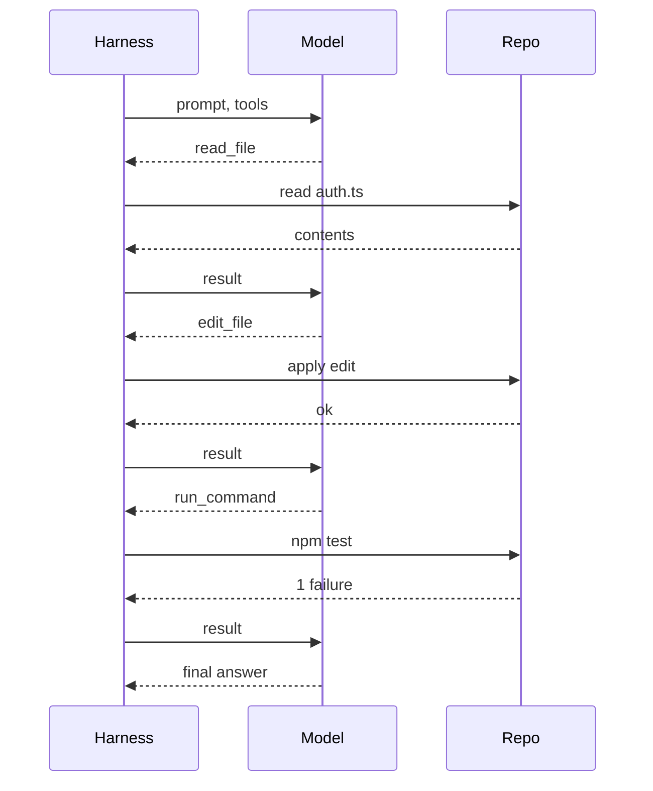

:::info[Prerequisites]
**LLM APIs** in LLM Fundamentals — messages, roles, and tool calls.
:::

## The loop, in full

An agent is a stateless model plus a program that keeps calling it. The model cannot read
a file or run a command; it can only emit a structured request to do so. The **harness**
executes that request and appends the result to the conversation, then calls the model
again.

Your task goes to the harness, which owns the loop below and reports back at the end:

Three things about this are worth internalising, because they explain most agent
behaviour:

**The conversation only grows.** Every file read and every command output is appended and
resent on the next call. A long session is not a model that remembers — it's the same
transcript being re-uploaded, which is why long sessions get slower and more expensive,
and why context management is the central engineering problem in agent harnesses.

**The model never acts; it only requests.** Every side effect passes through the harness,
which is the entire basis of the permission model. If the harness declines to run a
command, it doesn't run.

**The loop terminates when the model stops asking for tools.** There is no completion
signal beyond that, which is why "it stopped early" and "it kept going" are both common
failure modes with the same root cause: the model's own judgement about being done.

## What the harness contributes

Two harnesses wrapping the same model produce very different experiences. The differences
are worth knowing because they're what you're choosing between:

- **The tool surface.** A single `bash` tool is maximally flexible and gives the harness nothing to work with — every action is an opaque string. Dedicated `read`, `edit`, `grep`, and `glob` tools give it typed arguments it can validate, display, gate, and parallelise. Most good harnesses offer both and promote the actions that need supervision.
- **The system prompt.** Substantial, invisible, and doing a lot of work — establishing conventions, when to search, how to verify, and how much to explain.
- **Context management.** What to keep, what to summarise, what to drop.
- **Permissions.** Which actions run automatically, which require confirmation.
- **Repository knowledge.** Whether it reads your conventions file, and how it finds relevant code.

## Context management

The context window is finite and the transcript grows without bound, so every harness has
a strategy for what happens when they meet:

| Strategy | What it does | What it costs |
| --- | --- | --- |
| Truncation | Drop the oldest turns | Silent loss of early decisions |
| Summarisation | Compress history into a synopsis | Detail and exact wording; an extra model call |
| Tool-result pruning | Clear old file contents, keep the actions | Re-reading files it already saw |
| External memory | Write notes to a file the agent re-reads | Only works if it remembers to read them |

The visible symptom of all of them is the same and worth recognising: **an agent that
forgets a constraint you stated forty tool calls ago.** It isn't ignoring you; that text is
no longer in its context. The practical responses are to restate load-bearing constraints
periodically, to put durable ones in the conventions file where they're re-injected every
session, and to start a fresh session at natural task boundaries rather than running one
enormous conversation.

## Permissions and blast radius

An agent with shell access can do anything you can do. That is the point, and it is also
the risk — a model that misreads a path can delete the wrong directory, and one that reads
a malicious file can be persuaded to.

The controls that matter, roughly in order of importance:

- **Run in a sandbox.** A container or VM with the repository mounted and nothing else. This bounds the damage from every other failure and is the single most effective control available.
- **Approve the irreversible.** Reads and local edits are cheap to undo; `git push --force`, `rm -rf`, database migrations, deploys, and anything that sends a message outward are not. Gate those on explicit confirmation.
- **Commit before you start.** A clean working tree makes `git diff` the complete record of what changed and `git checkout .` a total undo.
- **Scope credentials.** An agent inheriting your production database URL and cloud admin token has that access whether or not the task needed it. Give it the narrowest environment that lets the task succeed.
- **Treat file contents as untrusted input.** An agent that reads a dependency's README, a downloaded issue, or a crawled page is reading text that may contain instructions aimed at it. This is indirect prompt injection, and it's the same problem as in **Context Assembly & Generation** — with a shell attached. Autonomy over untrusted content is the combination to avoid.

## Why agents fail

The characteristic failures have specific causes, and knowing them shortens debugging:

| Failure | Cause | Response |
| --- | --- | --- |
| Invents an API that doesn't exist | Plausible continuation, no verification step | Give it the real types; make it run the code |
| Ignores a convention used everywhere | The relevant file was never read | Name the file, or put it in the conventions file |
| Repeats a fix that already failed | The failure scrolled out of context | Restate it, or restart with what you learned |
| Declares done with failing tests | Never ran them, or misread the output | Require the test command in the definition of done |
| Sprawls across unrelated files | No stated scope | State the boundary in the prompt |
| Gets stuck retrying one approach | No signal that the approach is wrong | Interrupt and redirect; don't wait it out |

Nearly all of these come back to the same two levers: **what's in context**, and **whether
there's a feedback signal**. An agent with the right files in front of it and a test suite
it can run corrects itself. One with neither confabulates confidently — and generates a
lot of plausible output while doing it.

## Workflows and agents are different tools

A distinction worth making before adding machinery. A **workflow** has a control flow you
wrote: retrieve, then summarise, then classify. An **agent** decides its own control flow.

Workflows are more predictable, cheaper, easier to test, and sufficient for a large share
of tasks. Agents are the right answer when the steps genuinely can't be known in advance —
debugging, exploratory refactors, "find where this behaviour comes from". Reaching for an
agent where a three-step workflow would do is the most common over-engineering in this
space, and it costs latency, money, and determinism.

## What to take away

- The model only requests actions; the harness performs them. That's why the permission model works and where all supervision lives.
- The transcript grows and gets resent every turn, so long sessions get slower, costlier, and forgetful.
- "It forgot my constraint" is context management, not disobedience. Put durable constraints in the conventions file.
- Sandbox it, commit first, gate irreversible actions, and give it the narrowest credentials that work.
- Most agent failures reduce to missing context or a missing feedback signal — usually a test it could have run.
- Use a workflow when you know the steps. Use an agent when you genuinely don't.

## References

- Anthropic, [*Building effective agents*](https://www.anthropic.com/engineering/building-effective-agents) (2024)
- Yao et al., [*ReAct: Synergizing Reasoning and Acting in Language Models*](https://arxiv.org/abs/2210.03629) (2022) — the reason–act–observe loop
- Greshake et al., [*Not What You've Signed Up For: Compromising Real-World LLM-Integrated Applications with Indirect Prompt Injection*](https://arxiv.org/abs/2302.12173) (2023)
- [Anthropic — tool use overview](https://platform.claude.com/docs/en/agents-and-tools/tool-use/overview) · [OpenAI — function calling](https://platform.openai.com/docs/guides/function-calling)
