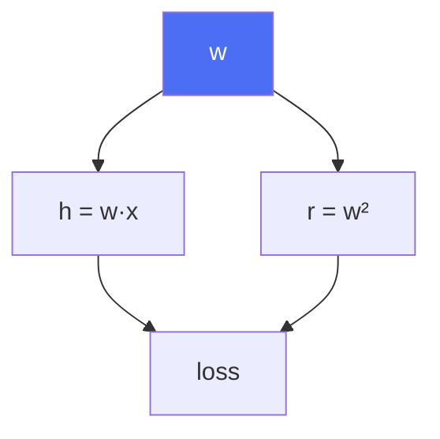

:::info[Prerequisites]
**Tensors, Shapes & Devices** — in particular that some operations return views and that
in-place ops exist.
:::

## The graph is built while you run the forward pass

PyTorch records operations as they execute. Every tensor produced by an operation on a
tensor with `requires_grad=True` carries a reference to the function that made it, so by
the time you have a scalar loss, there is a directed acyclic graph running back from that
loss to every parameter that contributed to it.

```python
w = torch.tensor([2.0], requires_grad=True)
x = torch.tensor([3.0])
y = w * x                 # y.grad_fn = <MulBackward0>
loss = (y - 1.0) ** 2
loss.backward()
w.grad                    # tensor([30.])
```

Two consequences follow from "built while you run", and both are why PyTorch feels the
way it does. The graph can contain arbitrary Python control flow — a loop whose trip
count depends on the data builds a different graph each iteration — and the graph is
**discarded after `backward()`**, which is why calling it twice raises unless you pass
`retain_graph=True`. If you find yourself reaching for that flag, the usual cause is
accidentally carrying a tensor across iterations rather than a genuine need.

**Leaf tensors** are the ones you created directly — parameters and inputs. Only leaves
with `requires_grad=True` accumulate into `.grad`. Intermediate results have gradients
computed and then thrown away, which is normally what you want.

## Gradients accumulate, and that is deliberate

`backward()` **adds** to `.grad` rather than replacing it. Hence the line that everyone
copies without knowing why:

```python
optimizer.zero_grad(set_to_none=True)
```

Omit it and each step uses the sum of every gradient computed since the run started —
the loss decreases erratically or diverges, with no error anywhere.

Accumulation isn't an accident of the API; it falls out of the chain rule. When a tensor
feeds more than one downstream path, its gradient is the **sum over paths**:



Here `w` is used by both the prediction and a regularisation term, so `dL/dw` is the sum
of the gradient arriving along each edge. The same mechanism gives you a useful feature
for free: **gradient accumulation** across mini-batches, which simulates a larger batch
than fits in memory.

```python
for i, (x, y) in enumerate(loader):
    loss = criterion(model(x), y) / accum_steps   # scale, or the LR is effectively larger
    loss.backward()
    if (i + 1) % accum_steps == 0:
        optimizer.step()
        optimizer.zero_grad(set_to_none=True)
```

This is exact for most losses but *not* for batch normalisation, whose statistics are
still computed per micro-batch — accumulating four batches of 8 is not equivalent to one
batch of 32 for a BN model.

## Turning autograd off

Recording the graph costs memory. During evaluation and inference you don't need it:

```python
with torch.no_grad():
    preds = model(x)
```

`torch.inference_mode()` is the stronger version — it additionally skips version
counters and view tracking, so it's faster, at the cost that tensors created inside it
can't later be used in autograd. Use `inference_mode` for serving and evaluation loops,
`no_grad` when a tensor produced inside might re-enter a graph.

Note that `no_grad` is **not** the same as `model.eval()`. `eval()` changes the behaviour
of dropout and batch norm; `no_grad` changes whether gradients are recorded. An
evaluation loop needs both, and forgetting `eval()` is the more damaging of the two
omissions because the numbers still look plausible.

To detach a single tensor from the graph, use `.detach()` — the standard use is stashing
a value for logging. Keeping `loss` itself in a list is a classic memory leak: the tensor
holds the whole graph alive, so the run's memory grows every step until it dies.
`loss.detach()`, or `loss.item()`, does not.

## Four things that break the graph

| Symptom | Cause |
| --- | --- |
| `element 0 of tensors does not require grad` | The chain to a leaf is broken — a `.detach()`, a `no_grad` block, a `.item()`/`.numpy()` round trip, or an input rebuilt from raw values |
| `a leaf Variable that requires grad is being used in an in-place operation` | Writing into a parameter directly. Wrap manual updates in `torch.no_grad()` |
| `one of the variables needed for gradient computation has been modified` | An in-place op overwrote a value the backward pass still needed. Drop the trailing `_`, or move the activation before the mutation |
| Memory grows every epoch | A tensor that still carries `grad_fn` is being retained — usually accumulated losses or metrics without `.detach()` |

Converting to NumPy and back is the sneakiest of these because it looks like data
handling rather than a graph operation. Once a value leaves the tensor world, the path
back to the parameters is gone, and the error surfaces later at `backward()` rather than
where it was caused.

## Clipping, and reading the gradients

Two lines that belong in most training loops:

```python
torch.nn.utils.clip_grad_norm_(model.parameters(), max_norm=1.0)
```

Clipping rescales the whole gradient vector when its norm exceeds a threshold. It is
close to mandatory for RNNs and transformers, where a rare bad batch produces an enormous
gradient that destroys otherwise-converged weights in a single step. It returns the
pre-clipping norm, which is worth logging in its own right: a gradient norm that spikes
by orders of magnitude tells you which batch to go and look at, and one that decays to
zero tells you the model has stopped learning before the loss curve makes it obvious.

For anything unusual — a custom kernel, a non-differentiable step, a numerically
awkward function — `torch.autograd.gradcheck` compares the analytic gradient against a
finite-difference estimate. Run it on a tiny `float64` example. It is much cheaper than
discovering a wrong derivative after a week of training.

## What to take away

- The graph is recorded during the forward pass and freed by `backward()`; Python control flow is therefore allowed.
- `.grad` accumulates. Call `zero_grad(set_to_none=True)` each step, and exploit accumulation deliberately for large effective batch sizes.
- A tensor used on several paths sums the gradients arriving from each.
- `no_grad`/`inference_mode` control graph recording; `model.eval()` controls layer behaviour. Evaluation needs both.
- `.detach()` anything you store for logging, or the graph stays alive and memory grows.
- Log the gradient norm. Clip it for transformers and RNNs.

## References

- [PyTorch — Autograd mechanics](https://pytorch.org/docs/stable/notes/autograd.html) — the authoritative description of leaves, in-place correctness, and graph lifetime
- [PyTorch — `torch.autograd` API](https://pytorch.org/docs/stable/autograd.html), including `gradcheck`
- Baydin et al., [*Automatic Differentiation in Machine Learning: a Survey*](https://arxiv.org/abs/1502.05767) (2018) — why reverse mode is the right choice for scalar losses
- Pascanu, Mikolov & Bengio, [*On the difficulty of training Recurrent Neural Networks*](https://arxiv.org/abs/1211.5063) (2013) — the origin of gradient clipping
