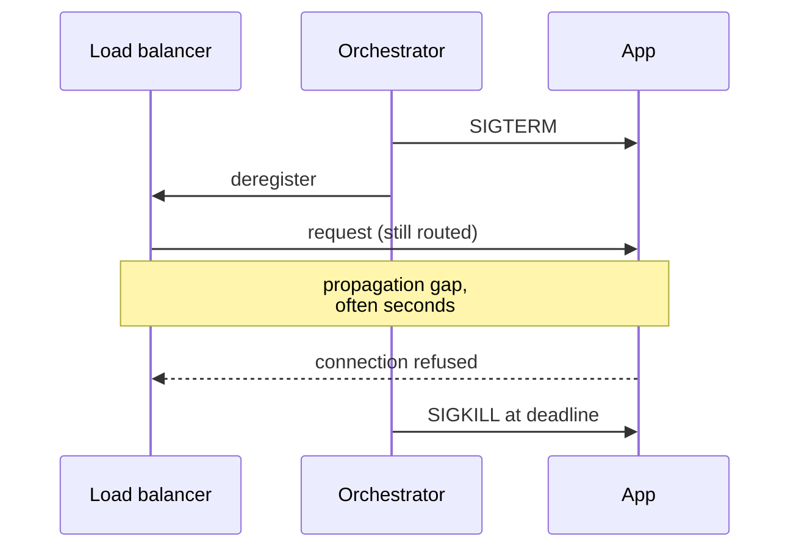

## The contract

Every platform that runs containers — Kubernetes, ECS, Cloud Run, Nomad, a single
host running `docker compose` — expects roughly the same things of the process inside.
Honour the contract and moving between platforms is a configuration change. Break it
and each platform breaks in its own way.

- **Configuration comes from the environment.** Environment variables and mounted files, not a `config.prod.yaml` baked into the image. The same image must be able to run in staging and production, because **Deploying Safely** depends on promoting one artifact through both.
- **Logs go to stdout and stderr.** The platform collects them. A container writing to `/var/log/app.log` is writing to a filesystem that disappears when it restarts, and nobody is tailing it.
- **The filesystem is ephemeral.** Anything that must survive a restart lives in a database, an object store, or an explicitly attached volume. Local disk is scratch space.
- **State lives outside.** Not because statelessness is a virtue, but because the platform will kill and reschedule this container without asking — for a deploy, a node drain, a scaling event, or a spot instance reclaim.
- **Listen on the port you were told to.** Usually `$PORT`. Bind to `0.0.0.0`, not `127.0.0.1`, or the platform's health check reaches nothing.

## Health checks: liveness, readiness, startup

Three questions that get collapsed into one endpoint and shouldn't be.

| Probe | Question | Failure means |
| --- | --- | --- |
| **Liveness** | Is this process wedged beyond recovery? | Kill and restart the container |
| **Readiness** | Can it serve traffic *right now*? | Remove from the load balancer; keep running |
| **Startup** | Has it finished booting? | Suppress the other probes until it passes |

The distinction matters because the remedies are so different. A service whose
database connection pool is exhausted should stop receiving traffic (readiness) and
should *not* be restarted (liveness) — restarting drops every in-flight request and
reconnects into the same exhausted pool.

Which produces the rule that saves the most outages: **a liveness probe must not
check dependencies.** If `/livez` queries Postgres, then a slow database restarts
every replica of every service that touches it, simultaneously, in a loop — a brief
database hiccup becomes a total outage. Liveness checks the process. Readiness checks
whether the process can currently do useful work, and may check dependencies, though
even there it's worth asking whether a degraded response beats no response.

Startup probes exist for the slow-boot case: a JVM warming up, a model loading into
memory. Without one you either set a liveness delay long enough to hide real hangs, or
short enough to kill the container mid-boot forever.

## Shutdown is a race, and you have to win it

When a platform stops a container, it sends `SIGTERM`, waits a grace period, then
sends `SIGKILL`. At the same time — not before — it starts removing the instance from
load balancer rotation. Those two things propagate at different speeds.

An application that exits promptly on `SIGTERM` — the intuitive, seemingly correct
behaviour — produces exactly the errors shown above on every single deploy. The fix
has two halves:

1. **Fail readiness first, and keep serving.** On `SIGTERM`, start returning failure from the readiness endpoint but continue accepting and completing requests. A `preStop` hook that simply sleeps a few seconds achieves the same thing for applications you can't modify.
2. **Then drain.** Stop accepting new connections, finish in-flight work, close pools, exit. The grace period must exceed your longest reasonable request; anything still running at the deadline is killed mid-flight.

Two implementation traps. The exec-form `ENTRYPOINT` point from the previous page
applies here: a shell wrapper as PID 1 swallows the signal and your handler never
runs. And PID 1 in Linux has no default signal handlers, so a process that never
installs one is immune to `SIGTERM` and always dies by `SIGKILL` — most language
runtimes handle this, some minimal entrypoints do not, which is what `--init` and
`tini` are for.

## Resource limits, and the two ways they bite

Platforms distinguish what a container is *guaranteed* (a request or reservation, used
for scheduling) from what it may *not exceed* (a limit). The two resources behave
completely differently at the ceiling:

- **CPU is throttled.** Exceed the limit and the kernel's CFS quota simply stops scheduling you for the rest of the 100 ms period. Nothing crashes; latency percentiles get worse. This is a leading cause of mysterious p99 spikes in otherwise healthy services, and it shows up in `container_cpu_cfs_throttled_seconds_total` long before anyone thinks to look.
- **Memory is fatal.** Exceed the limit and the kernel OOM-kills the process. No warning, no stack trace, exit code 137, and a restart. Runtimes with their own heap sizing need to be told about the limit — modern JVMs read cgroup limits by default, but a container whose limit is 512 MB and whose runtime believes it has the host's 64 GB will happily allocate its way to death.

Setting no limits at all is worse than setting imperfect ones: one leaking container
then takes down every other workload on the node.

## The compute spectrum

There is no single right answer, and the honest framing is a tradeoff between how much
control you want and how much operational surface you're willing to own.

| Option | You manage | Scales to zero | Best fit | Main cost |
| --- | --- | --- | --- | --- |
| **VM + systemd/Docker** | OS, patching, deploys, scaling | No | One or two services; predictable load; existing ops muscle | Everything is manual, including the parts you forget |
| **Managed container service** (Cloud Run, App Runner, Fargate) | Image and config | Usually yes | The default for a stateless HTTP service or worker | Less control over networking, scheduling, sidecars |
| **Kubernetes** | Workload specs, cluster policy, sometimes the cluster | With extra components | Many services, complex networking, real platform-team ownership | Genuine operational complexity — it is a platform to run, not a product to use |
| **Serverless functions** (Lambda, Cloud Functions) | A handler | Yes | Event-driven glue, spiky traffic, low request volume | Cold starts, execution limits, and a programming model that resists local reproduction |

Two observations that hold across the row. First, **Kubernetes is a reasonable answer
to a problem most teams don't have yet** — it earns its complexity when you have many
services, several teams, and a need for uniform networking, secrets and scheduling
policy. Adopting it for three services means paying the operational cost without the
benefit. Second, **scale-to-zero is a cost feature with a latency price**: cold starts
of a container-based platform are hundreds of milliseconds to seconds, which is fine
for a nightly job and not fine for an interactive path unless you keep a warm minimum.

## What to take away

- Config from the environment, logs to stdout, state outside the container. Everything else is negotiable; those aren't.
- Liveness, readiness and startup answer different questions — and a liveness probe that checks a dependency turns a slow database into a restart storm.
- On `SIGTERM`, fail readiness first and keep serving; exiting immediately guarantees dropped requests on every deploy.
- CPU limits throttle and hurt latency; memory limits kill. Always set both, and tell the runtime what they are.
- Pick the smallest platform that fits the actual service count and team, not the one that fits the org chart you hope to have.

## References

- [Kubernetes — Configure liveness, readiness and startup probes](https://kubernetes.io/docs/tasks/configure-pod-container/configure-liveness-readiness-startup-probes/)
- [Kubernetes — Pod lifecycle: termination](https://kubernetes.io/docs/concepts/workloads/pods/pod-lifecycle/#pod-termination) · [Resource management for pods and containers](https://kubernetes.io/docs/concepts/configuration/manage-resources-containers/)
- [The Twelve-Factor App — Config, Logs, Disposability](https://12factor.net/)
- [Google Cloud Run — Container runtime contract](https://cloud.google.com/run/docs/container-contract) · [AWS ECS on Fargate](https://docs.aws.amazon.com/AmazonECS/latest/developerguide/AWS_Fargate.html) · [AWS Lambda — Execution environment](https://docs.aws.amazon.com/lambda/latest/dg/lambda-runtime-environment.html)
- [Linux kernel — CFS bandwidth control](https://docs.kernel.org/scheduler/sched-bwc.html)
