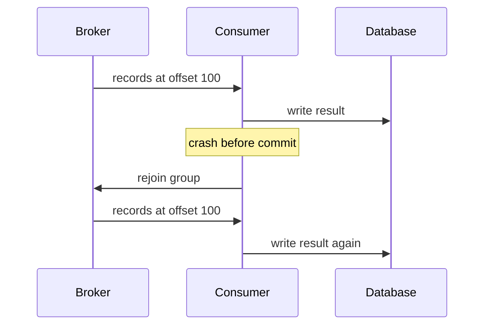

## Three guarantees, and only one of them is a real default

| Guarantee | Means | You get it by |
| --- | --- | --- |
| **At-most-once** | Records may be lost, never duplicated | Committing the offset before processing |
| **At-least-once** | Records may be duplicated, never lost | Committing the offset after processing |
| **Exactly-once** | Neither | Kafka transactions — within specific boundaries |

At-most-once is almost never what you want; losing an order is worse than emailing
someone twice. So the working default is **at-least-once**, and the design consequence
is unavoidable: **duplicates will happen, so consumers must be idempotent.** Everything
else on this page is detail around that sentence.

## Where duplicates come from

The offset commit and the side effect are two separate operations, and a crash between
them means the work is redone:

Swap the order — commit at 100, then process — and the crash loses the batch instead.
There is no ordering of two non-atomic operations that avoids both outcomes, which is
why the choice is between the two failure modes rather than out of them.

Rebalances produce the same effect without a crash: a consumer that loses a partition
mid-batch has done work it never committed, and the new owner starts from the last
committed offset.

## Producer settings

On the write side, the failure is symmetric — a producer that doesn't get an ack
retries, and the original write may have succeeded.

- **`enable.idempotence=true`** — the broker deduplicates retries from the same producer using a sequence number per partition, so a retried send doesn't append twice. This is the default in current clients, and it also implies `acks=all` and bounded retries.
- **`acks=all`** with `min.insync.replicas=2`, per the previous page.
- **`max.in.flight.requests.per.connection`** — with idempotence enabled, up to 5 in-flight requests preserve ordering. Without it, more than 1 in flight means a retried batch can land after a later one, silently reordering the partition.
- **Batching (`linger.ms`, `batch.size`)** is a throughput/latency tradeoff, not a correctness one. A few milliseconds of linger dramatically improves compression and throughput.

## Consumer settings

- **Turn off `enable.auto.commit`** for anything that matters. Auto-commit commits on a timer, on the poll thread, with no knowledge of whether your processing succeeded — which quietly gives you *neither* guarantee reliably.
- **Commit after processing**, per batch, not per record. Per-record commits are a round trip each and rarely necessary.
- **`auto.offset.reset`** decides what a group with no committed offset does: `earliest` (replay everything) or `latest` (start now). It applies to a brand-new consumer group *and* to one whose offsets expired — the latter is how a consumer that was down for a week silently skips a week of data under `latest`.

## Exactly-once, and what it actually covers

Kafka does provide exactly-once semantics, and the qualification matters more than the
headline. Transactions let a producer atomically write to multiple partitions and
commit consumer offsets *in the same transaction*, so a read-process-write pipeline —
consume from topic A, produce to topic B — either fully happens or fully doesn't.
Downstream consumers set `isolation.level=read_committed` to skip aborted records.

What it does not cover: **side effects outside Kafka.** If your consumer sends an
email, charges a card, or calls a third-party API, no Kafka transaction can roll that
back. Exactly-once is a property of Kafka-to-Kafka data flow, not of your application's
interaction with the world. For everything else, at-least-once plus idempotence is the
mechanism, and it's the one to reach for by default — transactions add coordination
overhead and operational complexity that a stream-processing pipeline may justify and a
notification consumer does not.

## Writing an idempotent consumer

Three approaches, in rough order of preference:

1. **Make the operation naturally idempotent.** `UPDATE users SET tier = 'gold' WHERE id = ?` is safe to run twice. `UPDATE accounts SET balance = balance + 10` is not. Prefer setting a value to incrementing one, and upserts to inserts.
2. **Deduplicate on a business key.** Give each event an id, and record processed ids in the same transaction as the effect. A unique constraint on `(consumer_name, event_id)` turns a duplicate into a caught constraint violation you can safely ignore. Note the "same transaction" — a separate dedup store reintroduces the exact problem it was meant to solve.
3. **Use a version or sequence number.** Reject records whose version is not greater than the one you've already applied. This handles reordering as well as duplication, which the other two don't.

For external calls, pass an idempotency key derived from the event id — the mechanism
covered in **HTTP Semantics** in Track 2 is the same one, arriving from the other side.

## Lag, poison messages, and dead letters

**Consumer lag** — the difference between the log end offset and the committed offset,
per partition — is the single most useful health metric for an event-driven system.
Growing lag means consumers are behind; flat lag at a high value means they're keeping
pace but never catching up; lag on one partition only means a hot key or a stuck
consumer. It's the metric to alert on, and it belongs in the on-call dashboard covered
in the next chapter.

A **poison message** is a record that fails deterministically — malformed payload, a
referenced row that no longer exists, a bug on one code path. Because the consumer
can't commit past it, retrying in place blocks the entire partition indefinitely.
Options:

- **Retry with backoff in place** for transient failures (a timeout, a 503). Bounded, then escalate.
- **Route to a dead-letter topic** after N attempts and commit past it. Simple and effective — but note that it breaks ordering for that key, which for some domains is unacceptable.
- **Stop the consumer** and page a human. Correct when ordering is sacred and skipping a record would corrupt downstream state.

Whichever you pick, the choice must be deliberate: the default behaviour of "retry
forever" is a decision to halt the pipeline, and it's usually made by accident. A
dead-letter topic also needs an owner, an alert, and a replay path — an unmonitored DLQ
is just a slower way of dropping data.

## What to take away

- At-least-once is the practical default, so idempotent consumers are a requirement, not an optimisation.
- Duplicates come from the gap between doing work and committing the offset; no ordering of the two avoids both failure modes.
- Keep producer idempotence on, use `acks=all` with `min.insync.replicas=2`, and don't exceed 5 in-flight requests.
- Turn off auto-commit and commit after processing.
- Kafka's exactly-once covers Kafka-to-Kafka flows, not side effects in the outside world.
- Deduplicate on an event id stored in the same transaction as the effect.
- Alert on consumer lag; decide in advance what happens to a message that always fails.

## References

- [Apache Kafka — Message delivery semantics](https://kafka.apache.org/documentation/#semantics)
- [KIP-98 — Exactly-once delivery and transactional messaging](https://cwiki.apache.org/confluence/display/KAFKA/KIP-98+-+Exactly+Once+Delivery+and+Transactional+Messaging)
- [Apache Kafka — Producer](https://kafka.apache.org/documentation/#producerconfigs) and [Consumer](https://kafka.apache.org/documentation/#consumerconfigs) configuration reference
- [Confluent — Transactions in Apache Kafka](https://www.confluent.io/blog/transactions-apache-kafka/)
- [IETF — The Idempotency-Key HTTP header field](https://datatracker.ietf.org/doc/draft-ietf-httpapi-idempotency-key-header/) — the same pattern for outbound HTTP calls
